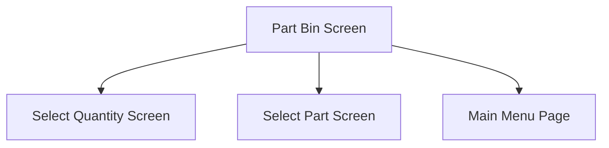

title: Part_Bin_Screen
description: 
published: true
date: 2023-01-25T15:44:18.035Z
tags: 
editor: markdown
dateCreated: 2023-01-25T15:22:59.319Z

This screen is used to select a quantity to issue from the selected Bin

# Flow

When the user taps the [Done Button](#done)
- The app will navigate to the [Select Quantity Screen](./Select_Quantity_Screen.md)

If the selected Part is **quantity-bearing**, and the user accepts the prompt to issue more Parts
- The app will navigate to the [Select Part Screen](./Select_Part_Screen.md)

If the selected Part is **quantity-bearing**, and the user declines the prompt to issue more Parts
- The app will navigate to the [Home Page](../../Home_Page.md)

# Controls
## Quantity
This control is used to enter a quantity to issue from the selected Part Bin

This control uses a numerical keyboard

## Select All
This control is used to enter the Part Bin's available quantity as the [Selected Quantity](#quantity)

### When This Button Is Tapped
The selected Part Bins selected quantity is set to the overall quantity of the Part Bin
- `PartBin.SelectedQuantity = PartBin.Quantity`

## Done
This button is used to validate the selection and navigate to the next screen, as defined under [Flow](#flow)

### When This Button Is Tapped
The app will validate the selection

If the [Selected Quantity](#quantity) is a negative number
- An error with the message "You cannot issue a negative quantity", is shown

If the part is **quantity-bearing**
- The part will be issued, see [Add & Issue Material Epicor Flow](../Add_%26_Issue_Material_Epicor_Flow.md)
- This is done since the user cannot select a Part Bin for a quantity-bearing part therefore they cannot backtrack to the [Select Quantity Screen](./Select_Quantity_Screen.md)

Otherwise, the app will navigate to the next screen, following the logic defined under [#Flow](#flow)