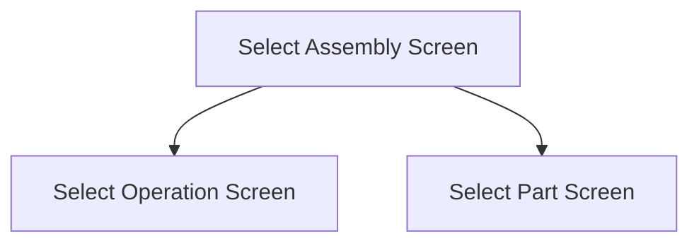

This screen is used to select an assembly, from a Job, to add & issue Parts to

# Flow

If the selected Assembly contains more than one operation
- The app will navigate to the [Select Operation Screen](./Select_Operation_Screen.md)

If the selected Assembly contains only one operation
- The app will automatically select that operation
- The app will navigate to the [Select Part Screen](./Select_Part_Screen.md)

# Toolbar
## Home Button
This button is used to navigate to the [Home Page](../../Home_Page.md)

# Controls
## Assembly
This control is used to select an Assembly from the selected Job

## Scan
This control is used to scan an Assembly from the selected Job, using the device's camera

### When This Button Is Tapped
See [Camera Scanning](#camera-scanning)

## Select
This control is used to validate the selection and navigate to the next screen, as defined under [Flow](#flow)

### When This Button Is Tapped
The app will validate the selection

If the [Selected Assembly](#assembly) is empty
- An error with the message, "You need to enter an assembly", is shown

The app will navigate to the next screen, following the logic defined under [Flow](#flow)

# Scanning
## Camera Scanning
The [Camera Scanning Process](../../../Scanning.md#camera-scanning) is started to retrieve the barcode

Then the logic defined under [How The Scanned Barcode Is Handled](#how-the-scanned-barcode-is-handled) is followed

## Data Wedge Scanning Process
When a barcode is scanned by a data wedge, the logic defined under [How The Scanned Barcode Is Handled](#how-the-scanned-barcode-is-handled) is followed

## How The Scanned Barcode Is Handled
The barcode is validated against the defined [Assembly Barcode Format](../../../Scanning.md#assembly-format)

If the barcode is invalid:
- The relevant [Barcode Validation Error](../../../Scanning.md#barcode-validation-errors) will be shown to the user

If the barcode is valid:
- The [When This Button Is Tapped](#when-this-button-is-tapped-1) is Followed