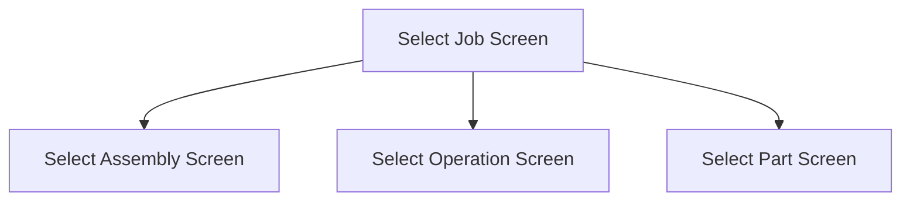

This screen is used to enter the Job Number of the Job to add and issue parts to

# Flow

If the selected Job contains more than 1 assembly
- The app will automatically select that assembly
- The will navigate to the [Select Assembly Screen](./Select_Assembly_Screen.md)

If the selected Job contains only 1 assembly but multiple operations
- The app will automatically select that assembly
- The app will navigate to the [Select Operation Screen](./Select_Operation_Screen.md)

If the selected Job contains only 1 assembly containing only 1 operation
- The app will automatically select that assembly
- The app will automatically select that operation
- The app will navigate to the [Select Part Screen](./Select_Part_Screen.md)

# Toolbar
## Home Button
This button is used to navigate back to the [Home Page](../../Home_Page.md)

# Controls
## Job Number
This control is used to input the Job Number

## Scan
This control is used to scan the Job Number with the device's camera

### When This Button Is Tapped...
See [Camera Scanning](#camera-scanning)

## Select
This control is used to validate the Job Number and navigate to the next screen as defined under the [Flow](#flow)

### When This Button Is Tapped
The app will retrieve the Job from Epicor
- This is done via a REST call to `~/JobEntrySvc/GetByID`

Then the logic as defined under [Flow](#flow) is followed

# Scanning
## Camera Scanning
The [Camera Scanning Process](../../../Scanning.md#camera-scanning) is started to retrieve the barcode

Then the logic defined under [How The Scanned Barcode Is Handled](#how-the-scanned-barcode-is-handled) is followed

## Data Wedge Scanning Process
When a barcode is scanned by a data wedge, the logic defined under [How The Scanned Barcode Is Handled](#how-the-scanned-barcode-is-handled) is followed

## How The Scanned Barcode Is Handled
The barcode is validated against the defined [Job Number Barcode Format](../../../Scanning.md#job-number)

If the barcode is invalid:
- The relevant [Barcode Validation Error](../../../Scanning.md#barcode-validation-errors) will be shown to the user

If the barcode is valid:
- The [Select Button Logic](#when-this-button-is-tapped-1) is Followed