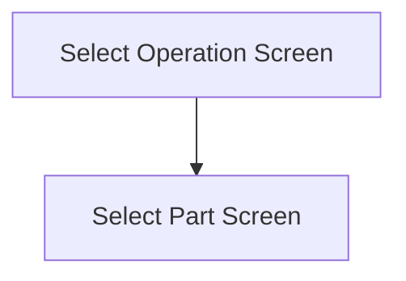

This screen is used to select an Operation, from the selected Assembly, to add and issue Parts to

# Flow

Once the user has selected an Operation
- The app will navigate to the [Select Part Screen](./Select_Part_Screen.md)

# Toolbar
## Home Button
This button is used to navigate back to the [Home Page](../../Home_Page.md)

## Help Button
This button is used to show the help screen for scanning on this page

# Controls
## Operation
This control is used to select an Operation from the selected Assembly

## Scan
This control is used to scan the [Operation](#operation) using the device's camera

## Select
This control is used to validate the selection and navigate to the next screen, using the logic as defined under [Flow](#flow)

### When This Button Is Tapped
The app will validate the selection

If no [Operation](#operation) has been selected
- An error with the message, "You need to enter an operation", will be show

The app will navigate to the next screen, using the logic defined under [Flow](#flow)

# Scanning
## Camera Scanning
The [Camera Scanning Process](../../../Scanning.md#camera-scanning) is triggered to allow the user to scan a barcode

See [How The Scanned Barcode Is Handled](#how-the-scanned-barcode-is-handled)

## Data Wedge Scanning
When a barcode is scanned by a data wedge, the logic defined under [How The Scanned Barcode Is Handled](#how-the-scanned-barcode-is-handled) is followed

## How The Scanned Barcode Is Handled
The barcode is validated against the defined [Operation Barcode Format](../../../Scanning.md#operation-format)

If the barcode is invalid
- The relevant [Barcode Validation Error](../../../Scanning.md#barcode-validation-errors) will be shown to the user

Then the app will attempt to find the scanned operation from the [Operations](#operation)

If no operation is found
- An error with the message "Operation '`OPERATION`' not found", will be shown to the user
	- Where `OPERATION` is the interpreted operation from the barcode

If an operation is found
* The [Select Button Logic](#when-this-button-is-tapped) is followed