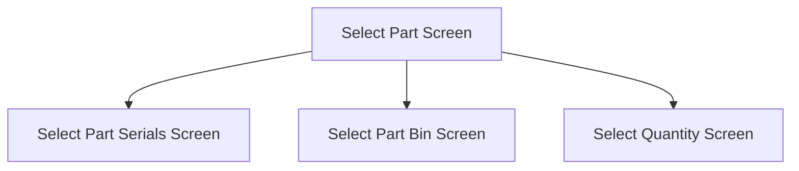

This screen is used to enter the Part to add and issue

# Flow

If the selected Part is **serial-tracked**
- The app will navigate to the [Select Part Serials Screen](./Select_Part_Serials_Screen.md)

If the selected Part is **not quantity-bearing** and **not serial-tracked**
- The app will navigate to the [Select Part Bin Screen](./Part_Bin_Screen.md)

If the selected Part is **quantity-bearing**
- The app will navigate to the [Select Quantity Screen](./Select_Quantity_Screen.md)

# Controls
## Material Part Number
This control is used to enter the Part number of the Part that the user wishes to add and issue

## Scan
This control is used to scan the [Part Number](#material-part-number)

### When This Button Is Tapped
See [Camera Scanning](#camera-scanning)

## Select
This control is used to validate the selection and navigate to the next screen

### When This Button Is Tapped
The app will retrieve the Part from Epicor
- This is done via a REST call to `~/Erp.BO.PartSvc/Parts`

If no Part is returned
- An error with the message, "Invalid Part Number", is shown

If the Part is not Quantity Bearing, as determined by `QtyBearing == false`
- The app will retrieve all Bins from the current Warehouse
	- This is done via a REST call to `~/Erp.BO.WhseBinSvc/WhseBins`
- If this is unsuccessful
	- An error with the Epicor response message is shown
- The app will set the selected Part Bin to the first result

The app will then navigate to the next screen, following the logic as defined under [Flow](#flow)

# Scanning
## Camera Scanning
The [Camera Scanning Process](../../../Scanning.md#camera-scanning) is triggered to allow the user to scan a barcode

See [How The Scanned Barcode Is Handled](#how-the-scanned-barcode-is-handled)

## Data Wedge Scanning
When a barcode is scanned by a data wedge, the logic defined under [How The Scanned Barcode Is Handled](#how-the-scanned-barcode-is-handled) is followed

## How The Scanned Barcode Is Handled
The barcode is validated against the defined [Part Barcode Format](../../../Scanning.md#part-format)

If the barcode is invalid
- The relevant [Barcode Validation Error](../../../Scanning.md#barcode-validation-errors) will be shown to the user

The app will set the [Selected Part](#material-part-number) to the interpreted Part Number from the barcode

The app will then follow the [Select Button Logic](#when-this-button-is-tapped-1)