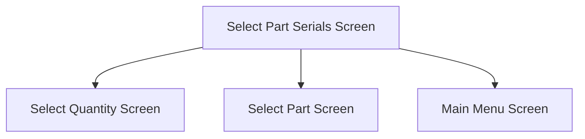

This screen is used to select serials for the selected Part to issue

This screen is only accessible by **serial-tracked parts**

# Flow

When the user taps the [Done Button](#done)
- The app navigates to the [Select Quantity Screen](./Select_Quantity_Screen.md)

If the selected Part is **not quantity-bearing**, if the user accepts the prompt to issue more Parts
- The app navigates to the [Select Part Screen](./Select_Part_Screen.md)

If the selected Part is **not quantity-bearing**, if the user declines the prompt to issue more Parts
- The app navigates to the [Home Page](../../Home_Page.md)

# When This Page Is Loaded
If the selected Part is **lot-tracked**, the selected Part's serials are retrieved from the selected Part Bin's lot from Epicor
- This is done via a REST call to `~/Erp.BO.SerialNoSvc/List`

If the selected Part is **not lot-tracked**, the selected Part's serials are retrieved from Epicor
- This is done via a REST call to `~/Erp.BO.SerialNoSvc/List`

# Controls
## Issued Complete
This control is used to mark the material movement as Issued Complete or not

## Part Serial List
This control displays the serials for the selected Part, with a Checkbox allowing the user to (de)select serials

## Scan
This control is used to scan the Serial Numbers using the device's camera

### When This Button Is Tapped
See [Camera Scanning](#camera-scanning)

## Done
This control is used to validate the selection and navigate to the next screen as defined under [Flow](#flow)

### When This Button Is Tapped
The app validates the selection

If no serials have been selected
- A error with the message, "Please select a Part Serial", is shown

The selected serials are then saved in the [Application Storage](../../../Application_Storage.md)

The app then navigates to the next screen, following the logic defined under [Flow](#flow)

# Scanning
## Camera Scanning
The [Camera Scanning Process](../../../Scanning.md#camera-scanning) is triggered to allow the user to scan a barcode

See [How The Scanned Barcode Is Handled](#how-the-scanned-barcode-is-handled)

## Data Wedge Scanning
When a barcode is scanned by a data wedge, the logic defined under [How The Scanned Barcode Is Handled](#how-the-scanned-barcode-is-handled) is followed

## How The Scanned Barcode Is Handled
The barcode is validated against the defined [Serial Barcode Format](../../../Scanning.md#serial-format)

If the barcode is invalid
- The relevant [Barcode Validation Error](../../../Scanning.md#barcode-validation-errors) will be shown to the user

Then the app will attempt to find the scanned serial from the [Serial List](#part-serial-list)

If no serial is found
- A toast with the message, "Serial '`SERIAL`' not found'", is shown
	- Where `SERIAL` is the interpreted Serial Number from the barcode

If a serial is found
* The checkbox of the found serial is checked
* A toast with the message, "Serial '`SERIAL`' selected''", is shown
	* Where `SERIAL` is the interpreted Serial Number from the barcode