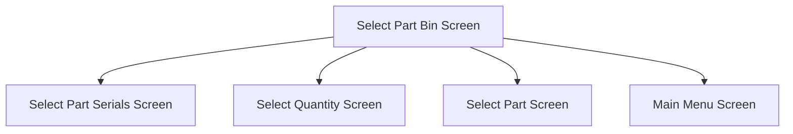

This screen is used to select a Part Bin to add and issue the selected Part from

# Flow

If the selected Part is **serial-tracked** when the user selects a [Part Bin](#part-bin-list)
- The app will navigate to the [Select Part Serials Screen](./Select_Part_Serials_Screen.md)

If the selected Part is **not serial-tracked** when the user selects a [Part Bin](#part-bin-list)
- The app will navigate to the [Part Bin Screen](./Part_Bin_Screen.md)

If the user accepts the offer to issue more Parts
- The app will navigate to the [Select Part Screen](./Select_Part_Screen.md)

If the user declines the offer to issue more Parts
- The app will navigate to the [Home Page](../../Home_Page.md)

# When This Page Is Loaded
The app retrieves the selected Part's locations from Epicor
- This is done via a REST call to `~/Erp.BO.PartBinSearchSvc/GetFullBinSearch`

If no Part Bins are found, or an error occurs during this request
- An error with the message, "Could not find any part bins. ", is shown

If the user had previously selected a quantity on the [Part Bin Screen](./Part_Bin_Screen.md) or serials from the [Select Part Serials Screen](./Select_Part_Serials_Screen.md)
- The app will apply the selection to the relevant Part Bin in the [Part Bin List](#part-bin-list)
- This includes
	- The selected quantity
	- The selected serials
	- The Issued Complete flag

# Controls
## Part Bin List
This control displays the available locations of the selected Part for the user to select

### When A Part Bin Is Tapped
The app save the selected Part Bin to the [Application Storage](../../../Application_Storage.md)

The app will then navigate to the next screen, following the logic defined under [Flow](#flow)

## Select All
This control is used to select all available quantity for all [Bins](#part-bin-list)

### When This Button Is Tapped
The app will set the Selected Quantity of each [Part Bin](#part-bin-list) to the available Quantity On Hand
- `partBin.SelectedQuantity = partBin.selectedQuantity`

NOTE: The Selected Quantity of Part Bins, with a negative available quantity, will be set to 0

## Done
This control is used to add & issue the selected Part from all of the [Selected Bins](#part-bin-list)

### When This Button Is Tapped
The selected Part will be added to the selected Operation and issued from the selected Part Bins

See [Add & Issue Material Epicor Flow](../Add_%26_Issue_Material_Epicor_Flow.md)

# Scanning
## Camera Scanning
The [Camera Scanning Process](../../../Scanning.md#camera-scanning) is triggered to allow the user to scan a barcode

See [How The Scanned Barcode Is Handled](#how-the-scanned-barcode-is-handled)

## Data Wedge Scanning
When a barcode is scanned by a data wedge, the logic defined under [How The Scanned Barcode Is Handled](#how-the-scanned-barcode-is-handled) is followed

## How The Scanned Barcode Is Handled
The barcode is validated against the defined [Warehouse Bin Barcode Format](../../../Scanning.md#warehouse-bin-format)

If the barcode is invalid
- The relevant [Barcode Validation Error](../../../Scanning.md#barcode-validation-errors) will be shown to the user

Then the app will attempt to find the scanned Part Bin from the [Part Bin List](#part-bin-list)

If no Part Bin is found
- An error with the message, "Bin '`BIN'` not found in Warehouse '`WAREHOUSE`'", is shown
	- Where `BIN` is the interpreted Bin Number from the barcode
	- Where `WAREHOUSE` is the interpreted Warehouse Code from the barcode

If a Part Bin is found
* The [Done Button Logic](#when-this-button-is-tapped-1) is followed