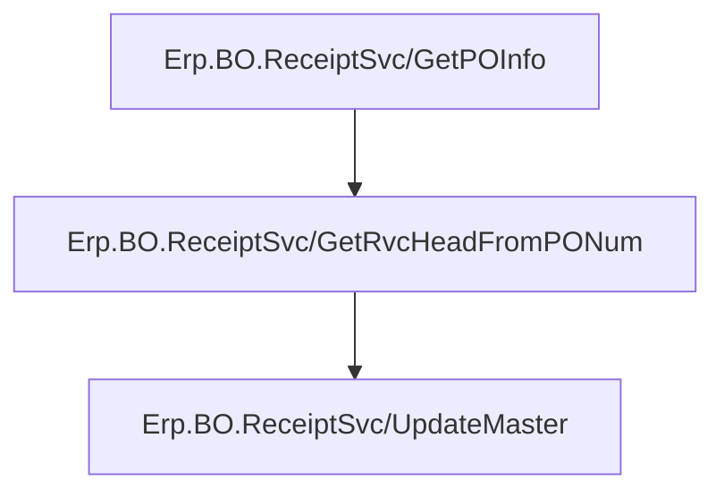
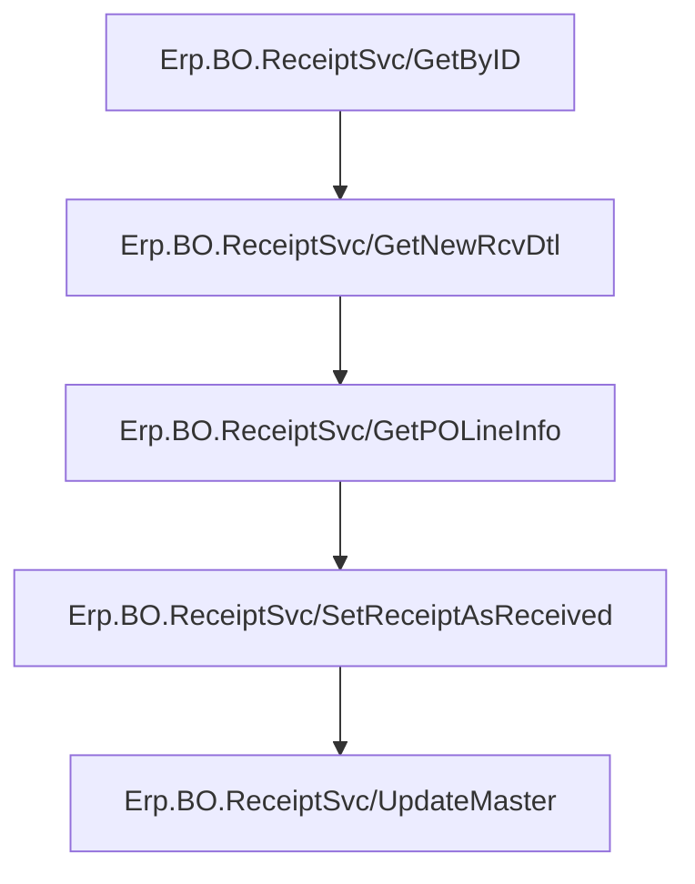
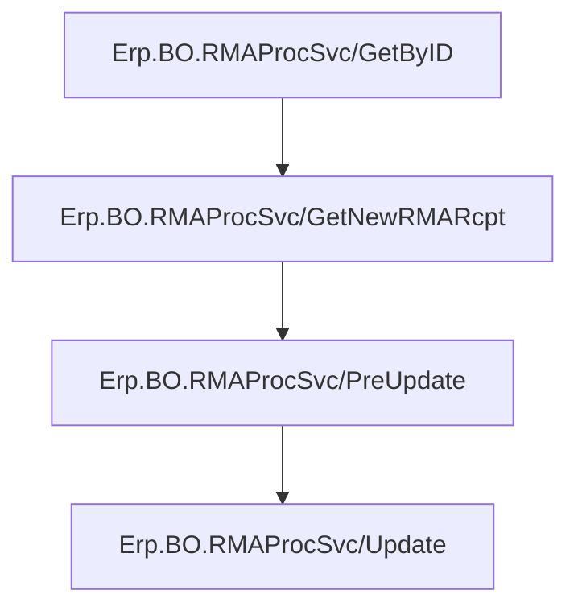

# Getting The RMA
The following REST calls are made in the following order

Then the unfinished lines are filtered, using the following criteria
- The total receipted quantity is less than the remaining `ReturnQty`
	- The total receipt quantity is calculated by summing the `ReceivedQty` of each receipt under the `Receipts` object
- `OpenRMA == true`
- `OpenDtl == true`

# Getting The PO
The following REST calls are made in the following order

Then the valid releases are filtered, using the following criteria
- `RelQty - ArrivedQty - ReceivedQty > 0`
- `OpenRelease == true`
- `DropShip == false`

# Creating The PO Receipt
Given that the PO Receipt already exists, [Creating A New PO Receipt](#creating-a-new-po-receipt) can be skipped

## Creating A New PO Receipt
The following REST calls are made in the following order

A call to `~/ERP.BO.ReceiptSvc/GetPOInfo` is made to get default information from the selected Purchase Order

A call to `~/Erp.BO.ReceiptSvc/GetRvcHeadFromPONum` is made to get additional information from the Purchase Order

A call to `~/Erp.BO.ReceiptSvc/UpdateMaster` is made to create the receipt

## Adding A Line To The PO Receipt
The following REST calls are made in the following order

A call to `Erp.BO.ReceiptSvc/GetByID` is made to get the receipt

A call to `~/Erp.BO.ReceiptSvc/GetNewRcvDtl` is made to get a new dataset for the receipt line

A call to `~/Erp.BO.ReceiptSvc/GetPOLineInfo` is made to get default information for the selected Purchase Order Line

A call to `~/Erp.BO.ReceiptSvc/SetReceiptAsReceived` is made to mark the receipt as receieved

A call to `~/Erp.BO.ReceiptSvc/UpdateMaster` is made to save the changes

# Creating The RMA Receipt
## Adding A Line To The RMA Receipt
The following REST calls are made in the following order

A call to `~/Erp.BO.RMAProcSvc/GetByID` is made to get the receipt to amend

A call to `~/Erp.BO.RMAProcSvc/GetNewRMAReceipt` is made to get a new dataset for the receipt line

A call to `~/Erp.BO.RMAProcSvc/PreUpdate` is made to get default information from Epicor

A call to `~/Erp.BO.RMAProcSvc/Update` is made to add the RMA Receipt line and save the changes

# Printing
## PO Receipts
The following API calls are made in the following order

- Refer to [How MIMS Creates Reports In Epicor](../../Printing.md#how-mims-creates-reports-in-epicor) for additional information about this REST call

## RMA Receipts
The following API calls are made in the following order

- Refer to [How MIMS Creates Reports In Epicor](../../Printing.md#how-mims-creates-reports-in-epicor) for additional information about this REST call