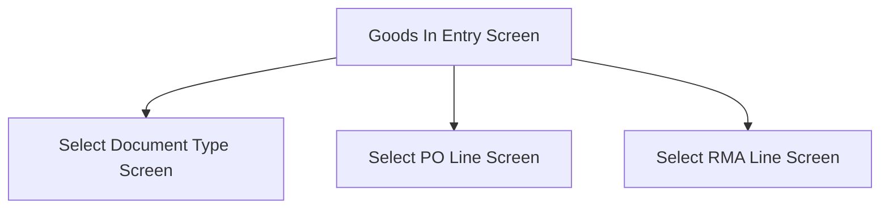

This screen is used to enter either the Purchase Order Number or the RMA Number

# Flow

Given that the User enters a [PO / RMA Number](#po--rma-number) that is the number of both a PO and RMA
- The app will navigate to the [Select Document Type Screen](./Select_Document_Type_Screen.md)

Given that the User enters a [PO / RMA Number](#po--rma-number) that is the number of a PO and not a RMA
- The app will navigate to the [Select PO Line Screen](./Select_PO_Line_Screen.md)

Given that the User enters a [PO / RMA Number](#po--rma-number) that is the number of a RMA and not a PO
- The app will navigate to the [Select RMA Line Screen](./Select_RMA_Line_Screen.md)

# When This Page Is Loaded
The following properties are removed from the [Application Storage](../../../Application_Storage.md)
- `SelectedPurchaseOrder`
- `SelectedPOLine`
- `SelectedPORelease`
- `SelectedDocumentType`
- `SelectedRMA`
- `SelectedRMALine`
- `SelectedLotNum`
- `SelectedSerials`
- `SelectedPartBin`
- `POReceipt`

# Controls
## PO / RMA Number
This control is used to enter the PO Number or the RMA Number

## Scan
This control is used to scan the [PO / RMA Number](#po--rma-number) using the device's camera

### When This Button Is Tapped
See [Camera Scanning](#camera-scanning)

## Select
This control is used to validate the selection and navigate to the next screen

### When This Button Is Tapped
The app will validate the selection

If no [PO / RMA Number](#po--rma-number) has been selected
- An error with the message, "Please enter a PO / RMA number", is shown

The app will try to retrieve the PO from Epicor
- See [Getting The PO](../Epicor_Processes.md#getting-the-po)

The app will try to retrieve the RMA from Epicor
- See [Getting The RMA](../Epicor_Processes.md#getting-the-rma)

If neither return a result
- An error with the message, "No PO Order or RMA Order was found. Please try again. ", is shown

Given that a PO and RMA were found
- The app will validate the PO against the following criteria
	- `Approved == true`
	- `ApprovalStatus == A`
	- `OpenOrder == true`
	- If the above criteria is not met, the PO will be discarded
- The app will validate the RMA against the following criteria
	- `OpenRMA == true`
	- If the above criteria is not met, the RMA will be discarded
- If both the PO and RMA are valid
	- The app will navigate to the [Select Document Type Screen](./Select_Document_Type_Screen.md)
- If only the PO is valid
	- The app will navigate to the [Select PO Line Screen](./Select_PO_Line_Screen.md)
- If only the RMA is valid
	- The app will navigate to the [Select RMA Line Screen](./Select_RMA_Line_Screen.md)
- If neither the PO or RMA is valid
	- An error with the message, "Invalid Choice, please enter a valid number", is shown

Given that only a PO was found
- The app will validate the PO
	- If `Approved` is not equal to `true`
		- An error with the message, "This PO cannot be processed as it is not approved", is shown
	- If `ApprovalStatus` is equal to `P`
		- An error with the message, "This PO cannot be processed as it is pending approval", is shown
	- If `OpenOrder` is equal to `false`
		- An error with the message, "This PO cannot be processed as it is not an open order", is shown
	- If the valid release count is `0`
		- An error with the message, "This PO cannot be processed as it has no lines to pick", is shown
- If validation is successful
	- The app will navigate to the [Select PO Line Screen](./Select_PO_Line_Screen.md)

Given that only a RMA was found
- The app will validate the RMA
	- If `OpenRMA` is equal to `false`
		- An error with the message, "This RMA cannot be processed as it is not an open RMA", is shown
	- If the unfinished line count is equal to `0`
		- An error with the message, "This RMA cannot be processed as it has no lines to pick", is shown
- If validation is successful
	- The app will navigate to the [Select RMA Line Screen](./Select_RMA_Line_Screen.md)

# Scanning
## Camera Scanning
The [Camera Scanning Process](../../../Scanning.md#camera-scanning) is triggered to allow the user to scan a barcode

Then logic defined under [How The Scanned Barcode Is Handled](#how-the-scanned-barcode-is-handled) is followed

## Data Wedge Scanning
When a barcode is scanned by a data wedge, the logic defined under [How The Scanned Barcode Is Handled](#how-the-scanned-barcode-is-handled) is followed

## How The Scanned Barcode Is Handled
The barcode is validated against the defined [PO / RMA Format](#po--rma-number)

If the barcode is invalid:
- The relevant [Barcode Validation Error](../../../Scanning.md#barcode-validation-errors) will be shown to the user

Then the app will set the [Selected PO / RMA Number](#po--rma-number) to the value of the barcode

Then the [Select Button Logic](#when-this-button-is-tapped-1) is followed