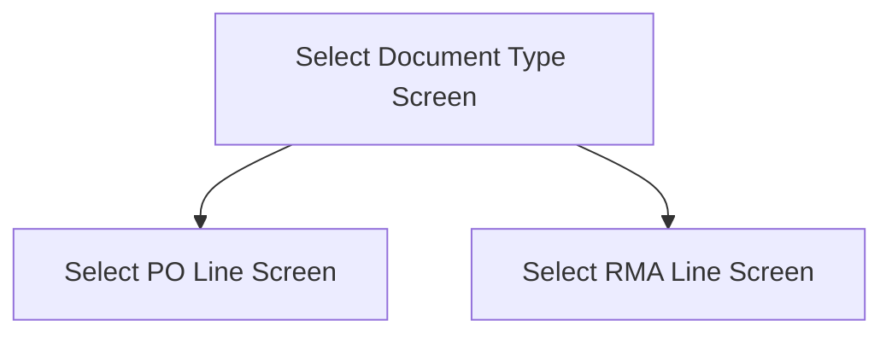

This screen is used to select between the retrieved PO and RMA, if both were returned from Epicor

# Flow

# Controls
## Purchase Order
This control is used to display the retrieved Purchase Order

### When This Button Is Tapped
The app will navigate to the [Select PO Line Screen](./Select_PO_Line_Screen.md)

## RMA
This control is used to display the retrieved RMA

### When This Button Is Tapped
The app will navigate to the [Select RMA Line Screen](./Select_RMA_Line_Screen.md)