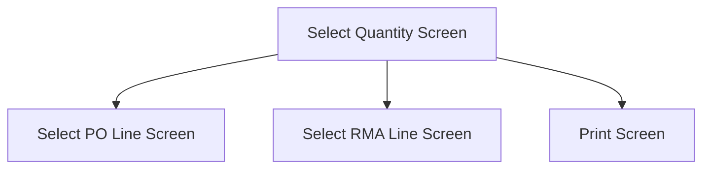

This screen is used to enter the quantity of the Part to receive

# Flow

If the selected Entry was a PO, and there are remaining lines to be received
- The app will navigate to the [Select PO Line Screen](./Select_PO_Line_Screen.md)

If the selected Entry was a RMA, and there are remaining lines to be received
- The app will navigate to the [Select RMA Line Screen](./Select_RMA_Line_Screen.md)

If the selected Entry contains no more lines to be received
- The app will navigate to the [Print Screen](./Print_Screen.md)

# When This Page Is Loaded
The app will automatically determine a default quantity to select

Given that the selected Entry is a PO
- If the selected Line's Part is serial-tracked
	- The [Quantity](#quantity) will be set to the amount of serials selected
- If the selected Line's Part is not serial-tracked
	- The [Quantity](#quantity) will be set to `RelQty - ArrivedQty - ReceievedQty`

Given that the selected Entry is a RMA
- If the selected Line's Part is serial-tracked
	- The [Quantity](#quantity) will be set to the amount of serials selected
- If the selected Line's Part is not serial-tracked
	- The [Quantity](#quantity) will be set to `ReturnQty - (Sum of receipt's ReceivedQty)`

# Controls
## Details
This control is used to display the details of the current selection

If the selected Entry is a PO, the following information will be displayed
- Part Number
- Part Description
- PO / Line
- Sales Order
- Required Quantity
- Receive Warehouse
- Receive Bin
- Lot Number (If lot-tracked)

If the selected Entry is a RMA, the following information will be displayed
- Part Number
- Part Description
- RMA / Line
- Sales Order
- Return Qty
- Receive Warehouse
- Receive Bin
- Lot Number (If lot-tracked)
## Quantity
This control allows the user to enter a quantity of the part that they wish to return

This entry uses a numerical keyboard

## Release Complete
This control allows the user to choose if they want to mark the transaction as Release Complete

## Receive
This button performs the material movement for the selected part

### When This Button Is Tapped
The receipt is created
- See [Creating The PO Receipt](../Epicor_Processes.md#creating-the-po-receipt), for PO's
- See [Creating The RMA Receipt](../Epicor_Processes.md#creating-the-rma-receipt), for RMA's

The following properties are cleared from [Application Storage](../../../Application_Storage.md)
- `SelectedLotNum`
- `SelectedSerials`
- `SelectedRMALine`
- `SelectedPOLine`
- `SelectedPartBin`
- `SelectedPOLine`

The app then navigates to the next screen as defined under [Flow](#flow)
