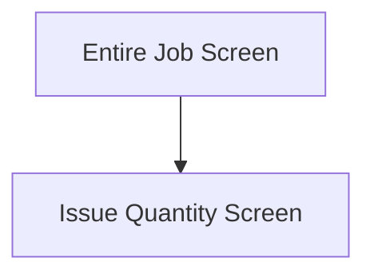
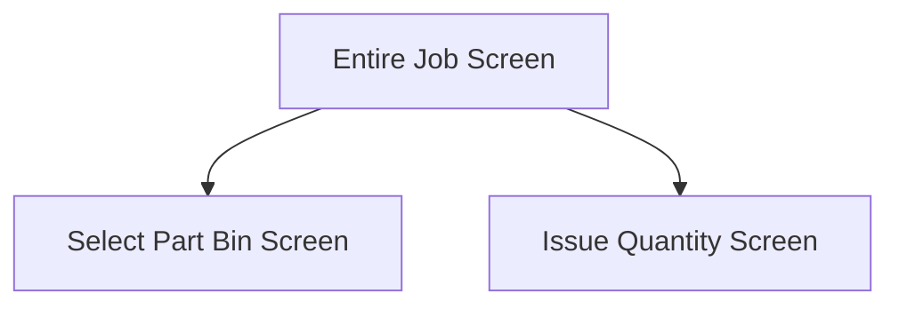
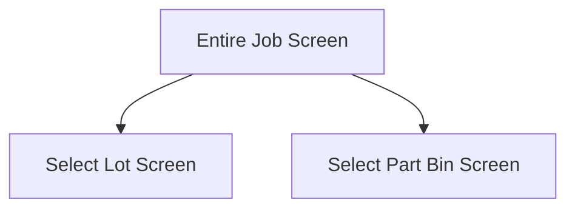
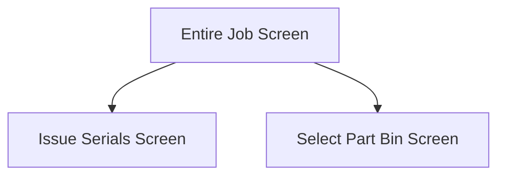

This screen will show a list of materials, to be issued, to the user

# Flow
Given that the selected material's part **is a non-quantity bearing part**, the following flow is possible:

- Non-quantity bearing parts will skip ahead to the [Issue Quantity Screen](./Issue_Quantity_Screen.md), as no location is required

Given that the selected material's part is **not lot-tracked or serial-tracked**, the following flow is possible:

- If the material's part exists in **more than one bin**, the app navigates to the [Select Part Bin Screen](./Select_Part_Bin_Screen.md)
- If the material's part exists in **only one bin**, the app navigates to the [Issue Quantity Screen](./Issue_Quantity_Screen.md)

Given that the selected material's part **is lot-tracked**, the following flow is possible:

- If the material's part exists in **more than one bin**, the app navigates to the [Select Part Bin Screen](./Select_Part_Bin_Screen.md)
- If the material's part exists in **only one bin**, the app navigates to the [Select Lot Screen](./Select_Lot_Screen.md)

Given that the selected material's part is **not lot-tracked, but is serial tracked**, the following flow is possible:

- If the material's part exists in **more the one bin**, the app navigates to the [Select Part Bin Screen](./Select_Part_Bin_Screen.md)
- If the material's part exists in **only one bin**, the app navigates to the [Issue Serials Screen](./Issue_Serials_Screen.md)

# Material Categories
The materials are grouped into the following categories:
- Materials To Issue
- Backflush Materials
- Issued Materials
- Materials Without Stock

## Materials To Issue
Materials to issue will show the following information, if available:
- Part Number
- Part Description
- Warehouse Code & Bin Number
	- If the part is Quantity Bearing, the text `QTY BEARING PART` is shown
	- If the part has no stock, the text `NO STOCK AVAILABLE` is shown
- Required Quantity

## Backflush Materials
Backflush materials cannot be issued and are disabled

Backflush Materials will show the following information, if available:
- Part Number
- Part Description
- Warehouse Code & Bin Number
	- If the part has no stock, the text `NO STOCK AVAILABLE` is shown
- Issued Quantity

## Issued Materials
Issued Materials are shown for convenience and cannot be issued any further

Issued Materials will show the following information, if available:
- Part Number
- Part Description
- Warehouse Code & Bin Number
	- If the part has no stock, the text `NO STOCK AVAILABLE` is shown
- Issued Quantity

## Materials Without Stock
Materials Without Stock cannot be issued as there is no stock

Materials Without Stock will show the following information, if available:
- Part Number
- Part Description
- Warehouse Code & Bin Number
	- If the part has no stock, the text `NO STOCK AVAILABLE` is shown
- Issued Quantity

# When This Page Is Loaded...
Additional information about each material is retrieved from Epicor
- This is done via a REST call to `~/BaqSvc/GHA_MIMS_JobMaterials
	- See [GHA_MIMS_JobMaterials](../../../Epicor/BAQs/GHA_MIMS_JobMaterials.md)

The information includes:
- The first Warehouse Bin that has on-hand quantity for the material
	- The Warehouse Bin must be marked as a picking location for MIMS
		- This is determined by the user field [GHA_MIMS_PickLoc_c](../../../Epicor/User_Fields/Warehse/GHA_MIMS_PickLoc_c.md)
	- The Bin Number, Warehouse Code, Dim Code, Bin Sequence and [GHA_MIMS_SequenceNo_c](../../../Epicor/User_Fields/Warehse/GHA_MIMS_SequenceNo_c.md) are retrieved
- Whether the material Part is Quantity Bearing or not

If retrieving the additional information is not successful:
- The following error message will be shown to the user
- The materials will still be shown, but some features will be missing such as:
	- Ordering the bins by chosen sequence
	- Quantity Bearing parts won't be detected (so the [Part Bin Screen](./Select_Part_Bin_Screen.md) will still be shown)
	- Warehouse and Bin Numbers won't be shown alongside the material

The materials are then filtered by the selected assembly and operation:
- If no assembly or operation was selected, all materials are shown

Then the materials are grouped into the [Material Categories](#material-categories) above

# Controls
## Material List
This list shows the available materials on the Assembly / Operation grouped into the [Material Categories](#material-categories)

### When A Material To Be Issued Is Tapped...
The selected material is updated in the application data

If the material is set to backflush, a prompt will be shown to the User
- If the user chooses "Yes", the selection process will continue
- If the user chooses "No", the selection process will end

If the material's part is not Quantity Bearing:
-  The app will retrieve the first Part Bin, that has this part
	- This is done via a REST call to `~/Erp.BO.PartWhseSearchSvc/List`
	- And the a subsequent REST call to `~/Erp.BO.WhseBinSvc/WhseBins(Company, WarehouseCode, Bin)`
- Then the app will navigate to the [Issue Quantity Screen](./Issue_Quantity_Screen.md)

Otherwise, the app will check if there is more than one Part Bin that contains this part
* This is done via a REST call to `~/Erp.BO.PartBinSearchSvc/GetFullBinSearch`
	* Warehouse information is retrieved for each bin via a REST call to `~/Erp.BO.WarehseSvc/Warehses`
		* This information includes: `Plant`, `WarehouseCode`, `Description`, `GHA_MIMS_PickLoc_c` and `GHA_MIMS_SequenceNo_c`
	* These bins are then filtered by the following criteria:
		* Must be marked as a picking location, see [GHA_MIMS_PickLoc_c](../../../Epicor/User_Fields/Warehse/GHA_MIMS_PickLoc_c.md)
		* Must not be a supplier managed bin
		* Must have an on hand quantity greater than zero for the selected Part

If only 1 Part Bin is found:
- The app will automatically select this bin
- Then the app will navigate to the:
	- [Select Lot Screen](./Select_Lot_Screen.md) - if the part is **lot tracked**
	- [Select Serial Screen](./Issue_Serials_Screen.md) - if the part is **serial tracked**
	- [Issue Quantity Screen](./Issue_Quantity_Screen.md) - if the part is **not serial tracked**

Otherwise, the app will navigate to the [Select Part Bin Screen](./Select_Part_Bin_Screen.md)

## Scan Warehouse
This button can be used to further filter the materials by the scanned Warehouse

### When This Button Is Tapped...
The [Camera Scanning Process](../../../Scanning.md#camera-scanning) is triggered to allow the user to scan a Warehouse

The Selected Warehouse is updated in the application data

Then the material list is filtered by this warehouse

## Scan Part
This button can be used to select a material via the scanned Part Number

### When This Button Is Tapped...
See [Camera Scanning](#camera-scanning)

# Scanning
## Camera Scanning
The [Camera Scanning Process](../../../Scanning.md#camera-scanning) is triggered to allow the user to scan a barcode

Then logic defined under [How The Scanned Barcode Is Handled](#how-the-scanned-part-barcode-is-handled) is followed

## Data Wedge Scanning
**NOTE: Only the Part can be scanned by the Data Wedge, the Warehouse scanning option is disabled if a Data Wedge is detected**

When a barcode is scanned by a data wedge, the logic defined under [How The Scanned Barcode Is Handled](#how-the-scanned-part-barcode-is-handled) is followed

## How The Scanned Part Barcode Is Handled
The barcode is validated against the defined [Part Format](../../../Scanning.md#part-format)

If the barcode is invalid:
- The relevant [Barcode Validation Error](../../../Scanning.md#barcode-validation-errors) will be shown to the user

Then the app will attempt to find the scanned material from the list of [Materials](#material-list)

If no material is found:
- An error with the message "Could not find the scanned part. " will be shown to the user

If a material is found:
* The [Material Tap Logic](#when-a-material-to-be-issued-is-tapped) is followed

## How The Scanned Warehouse Barcode Is Handled
The app will refresh and further filter the material list, only showing parts:
* Under the selected assembly (if selected)
* Under the selected operation (if selected)
* Under the scanned warehouse code