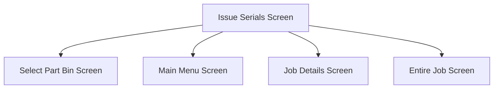

This screen is used to issue a Serial Tracked part '../../../../Technical Documentation/Applets/Job Picking/Screens'to a job

In this screen, the user can select from a list of existing serial numbers for the selected part. The user may then issue however many of these serials as they wish

This screen will display the selected Part's required quantity using the formula:
- `Total Required Quantity - Issued Quantity`

# Flow

- If the Job Material was partially issued, the app will navigate to the [Select Part Bin Screen](./Select_Part_Bin_Screen.md)
- If the Job is entirely issued, the app will navigate to the [Home Page](../../Home_Page.md)
- If all Job Material's under the selected operation have been issued, the app will navigate to the [Job Details Screen](./Job_Details_Screen.md)
- If the Job Material was fully issued, the app will navigate to the [Entire Job Screen](./Entire_Job_Screen.md)

# When This Page Is Loaded
The app will check if the selected Part is Lot Tracked

If the Part is Lot Tracked:
- The Part's serials will be retrieved from selected Part Bin's lot
	- This is done via a REST call to `~/SerialNoSvc/List`

If the Part is not Lot Tracked:
- The Part's serials will be retrieved from the selected Part Bin
	- This is done via a REST call to `~/SerialNoSvc/List`

If no serials are found
- An error with the message, "Could not find any serials to issue", will be shown

# Controls
## Issued Complete
This controls whether the material transaction should be marked as Issued Complete or not

## Part Serials
This list shows all of the available serials that can be selected to be issued

The user may select any of the serials in and order they please

## Scan
This button is used to scan the serials to select them

### When This Button Is Tapped
See [Camera Scanning](#camera-scanning)

## Issue
This button will perform the material transaction, moving the chosen serials from the selected warehouse bin to the selected job

### When This Button Is Tapped
The selection is validated

If no serials have been selected:
- An error with the message, "Please choose at least one serial", will be shown to the user

Otherwise, the material transaction will be performed
- This is done via a REST call to `~/IssueReturnSvc/PerformMaterialMovement`

This call will issue the selected Serials:
- To the selected Job Material
- From the selected Warehouse
- From the selected Part Bin
- From the selected Lot
- Using the chosen [Issued Complete](#issued-complete) value

#### Advanced Material Management
**If [AMM](../../../AMM_Handling.md) is not licensed**
- The `ToWarehouseCode` and `ToBinNum` parameters will not be set

**If [AMM](../../../AMM_Handling.md) is licensed** 
- The `ToWarehouseCode` and `ToBinNum` parameters will be set to the selected Warehouse and Part Bin

# Scanning
## Camera Scanning
The [Camera Scanning Process](../../../Scanning.md#camera-scanning) is triggered to allow the user to scan the serials

Then logic defined under [How The Scanned Barcode Is Handled](#how-the-scanned-barcode-is-handled) is followed

# Data Wedge Scanning
**NOTE: Only the Part can be scanned by the Data Wedge, the Warehouse scanning option is disabled if a Data Wedge is detected**

When a barcode is scanned by a data wedge, the logic defined under [How The Scanned Barcode Is Handled](#how-the-scanned-barcode-is-handled) is followed

# How The Scanned Barcode Is Handled
The barcode is validated against the defined [Serial Format](../../../Scanning.md#serial-format)

If the barcode is invalid:
- The relevant [Barcode Validation Error](../../../Scanning.md#barcode-validation-errors) will be shown to the user

Then the app will attempt to find the scanned serial from the list of [Serials](#part-serials)

If no serial is found:
- A toast with the message, "Serial 'SERIALNUMBER' not found. Try again", will be shown to the user
	- `SERIALNUMBER` being the serial number interpreted from the scanned barcode

If a serial is found:
- The found serial number will be selected and checked within the list of [Serials](#part-serials)
* A toast with the message, "Serial 'SERIALNUMBER' scanned", will be shown to the user
	* `SERIALNUMBER` being the serial number interpreted from the scanned barcode
