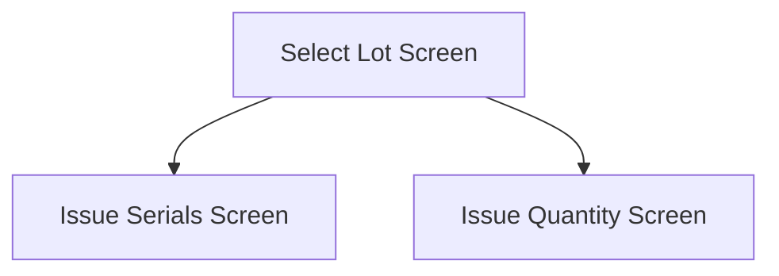

This screen is used to select a Lot to issue from

This screen is only shown if the part is Lot tracked

# Flow

- If the material's part **is Serial Tracked**, the app will navigate to the [Issue Serials Screen](./Issue_Serials_Screen.md)
- If the material's part **is not Serial Tracked**, the app will navigate to the [Issue Quantity Screen](./Issue_Quantity_Screen.md)

# When This Page Is Loaded...
The Lot Numbers, for the selected Part, are retrieved from Epicor
- This is done via a REST call to `~/Erp.BO.LotSelectUpdateSvc/LotSelectUpdates`

The app will remember the last chosen Lot Number, from a previous selection, and set this as the default selected [Lot Number](#lot-number)

If no Lot Number was previously selected, the first Lot Number is chosen as the default

# Controls
## Lot Number
This picker contains a list of Lot Numbers, for the selected Part, that the user can select from

## Scan
This button will allow the user to scan a Lot Number using the device's camera

### When This Button Is Tapped
See [Camera Scanning](#camera-scanning)

## Next Lot
This button will generate the next lot number for the selected Part and automatically select it

### When This Button Is Tapped...
A REST call is made to `~/Erp.BO.LotSelectUpdateSvc/GenerateNewLotNum` to generate the next Lot Number

This new Lot Number is then set as the selected [Lot Number](#lot-number)

## Select
This button will validate the selection and navigate to either the [Issue Quantity Screen](./Issue_Quantity_Screen.md) or the [Issue Serials Screen](./Issue_Serials_Screen.md) based on if the selected Part is Serial Tracked

### When This Button Is Tapped
The app checks that a Lot Number has been selected
- If no Lot Number has been selected, an error with the message "Please select a Lot Number" will be shown to the user

Otherwise, the app will follow the navigation logic as defined in the [Flow](#flow)

# Scanning
## Camera Scanning
The [Camera Scanning Process](../../../Scanning.md#camera-scanning) is triggered to allow the user to scan a barcode

Then logic defined under [How The Scanned Barcode Is Handled](#how-the-scanned-barcode-is-handled) is followed

## Data Wedge Scanning
When a barcode is scanned by a data wedge, the logic defined under [How The Scanned Barcode Is Handled](#how-the-scanned-barcode-is-handled) is followed

## How The Scanned Barcode Is Handled
The barcode is validated against the defined [Lot Format](../../../Scanning.md#lot-format) 

If the barcode is invalid:
- The relevant [Barcode Validation Error](../../../Scanning.md#barcode-validation-errors) will be shown to the user

Then the app will attempt to find the scanned Lot Number from the list of [Lot Numbers](#lot-number)

If no Lot Number is found:
- An error with the message "Could not find the scanned lot number", will be shown to the user

If a Lot Number is found:
* The [Select Button Logic](#when-this-button-is-tapped-2) is followed