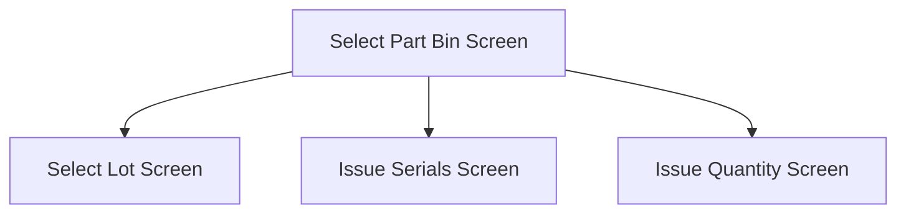

This screen is used to select a Part Bin to issue the selected Part from

This page will displayed the required quantity for the part '../../../../Technical Documentation/Applets/Job Picking/Screens'using the formula:
- `Total Required Quantity - Issued Quantity`

# Flow

- If the selected material's part **is lot-tracked**, the app will navigate to the [Select Lot Screen](./Select_Lot_Screen.md)
- If the selected material's part **is not lot-tracked but is serial-tracked**, the app will navigate to the [Issue Serials Screen](./Issue_Serials_Screen.md)
- If the selected material's part **is neither lot-tracked or serial-tracked**, the app will navigate to the [Issue Quantity Screen](./Issue_Quantity_Screen.md)

# Controls
## Part Bin List
This control contains a list of available Part Bins for the selected Part

*NOTE: these bins would have been retrieved in the [Entire Job Screen](./Entire_Job_Screen.md) when the user selected a material (see [When A Material To Be Issued Is Tapped](./Entire_Job_Screen.md#when-a-material-to-be-issued-is-tapped)])*

### When A Part Bin Is Tapped
The app will save the selected Part Bin in the [Application Storage](../../../Application_Storage.md)

The app will then navigate to the relevant screen as defined in the [Flow](#flow)

## Back
This button allows the user to navigate back to the [Entire Job Screen](./Entire_Job_Screen.md)

### When This Button Is Tapped
The app will navigate back to the [Entire Job Screen](./Entire_Job_Screen.md)