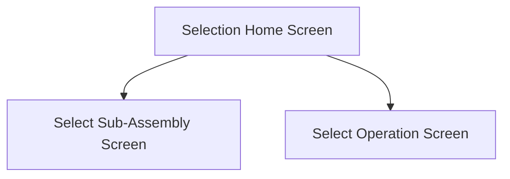

title: Selection_Home_Screen
description: 
published: true
date: 2023-01-25T09:40:31.816Z
tags: 
editor: markdown
dateCreated: 2023-01-25T09:09:40.939Z

This screen is used to filter the material selection

This can be done by selecting an assembly or operation

This will then navigate to the [Select Sub-Assembly Screen](./Select_Sub-Assembly_Screen) or the [Select Operation Screen](./Select_Operation_Screen)

# Flow

# When This Page Is Loaded...
The [Select Sub-Assembly Button](#select-sub-assembly) is disabled if [the following criteria is not met](#this-button-is-disabled-if)

The [Select Operation Button](#select-operation) is disabled if [the following criteria is not met](#this-button-is-disabled-if-1)

# Controls
## Select Sub-Assembly
This button can be used to navigate to the [Select Sub-Assembly Screen](./Select_Sub-Assembly_Screen.md)

### This Button Is Disabled If...
This button is disabled if none of the assemblies meet the following criteria:
- The assembly must not be the main assembly
- The assembly contains at least one material that:
	- Is not Issued Complete `(IssuedComplete = False)`
	- Needs to be issued `(IssuedQty - RequiredQty > 0)`

### When This Button Is Tapped...
The selected assembly is cleared from the application data

The app navigates to the [Select Sub-Assembly Screen](./Select_Sub-Assembly_Screen.md)

## Select Operation
This button can be used to navigate to the [Select Operation Screen](./Select_Operation_Screen.md)

### This Button Is Disabled If...
This button is disabled if the none of the operations meet the following criteria:
- The operation is a part of the main assembly
- The operation is not complete
- The operation contains at least one material that:
	- Is not Issued Complete `(IssuedComplete = False)`
	- Needs to be issued `(IssuedQty - RequiredQty > 0)`

### When This Button Is Tapped...
The selected operation is cleared from the application data

The selected assembly is set the the job's main assembly in the application data

Then the app navigates to the [Select Operation Screen](./Select_Operation_Screen.md)