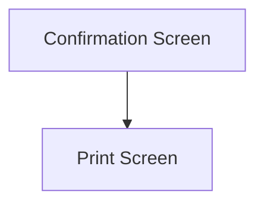

This page is used to confirm the selection, before performing the Receipt

This page will display the selected Job Demand's Type, which is one of either
- "Make to Stock"
- "Make to Job"

# Flow

# Controls
## Confirmation Details
This control is used to display the following details of the current selection
- The Job Demand Type
	- "Make to Stock" or "Make to Job"
- The Selected Quantity
	- This will specify whether the selected Quantity are serials or not

Given that the selected Job Demand's Make To Type is "Make to Stock", the following information will also be displayed
- The selected Job's number
- The selected Warehouse's Description 
- The selected Warehouse Bin's Description
- If the selected Job Demand's Part is Lot Tracked, the following information will also be displayed
	- The selected Lot Number

Given that the selected Job Demand's Make To Type is "Make to Job", the following information will also be displayed
- The selected Job's number
- The selected Job Demand's Target Job Number
- The selected Job Demand's Target Assembly Sequence
- The selected Job Demand's Target Material Sequence
- The selected Warehouse's Description
- The selected Warehouse Bin's Description
- If the selected Job Demand's Part is Lot Tracked, the following information will also be displayed
	- The selected Lot Number

## Back
This control is used to navigate back to the previous page

### When This Button Is Tapped
The app will navigate to the previous page

## Perform Receipt
This control is used to perform the Receipt

### When This Button Is Tapped
Refer to [Perform Receipts](../Epicor_Processes.md#perform-receipts) for further information