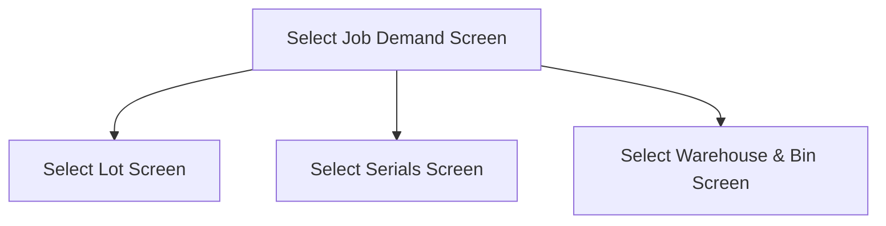

This screen is used to select a Job Demand from a list of Job Demands against the previously selected Job

# Flow

If the selected Job Demand's Part is lot-tracked
- The app will navigate to the [Select Lot Screen](./Select_Lot_Screen.md)

If the selected Job Demand's Part is serial-tracked, but not lot-tracked, the app will check if the serial numbers have been correctly assigned & matched to the selected Job
- See [Serial Matching](../Epicor_Processes.md#serial-matching) for further information

If the above check is successful
- The app will navigate to the [Select Serials Screen](./Select_Serials_Screen.md)

If the selected Job Demand's Part is neither serial-tracked or lot-tracked
- The app will navigate to the [Select Warehouse & Bin Screen](./Select_Warehouse_%26_Bin_Screen.md)

# Controls
## Job Demand List
This control is used to select a Job Demand from the list of Job Demands on the selected Job

### When A Job Demand Is Tapped
The app will save the selected Job Demand to the [Application Storage](../../../Application_Storage.md)

The app will then navigate to the next screen as defined under [Flow](#flow)