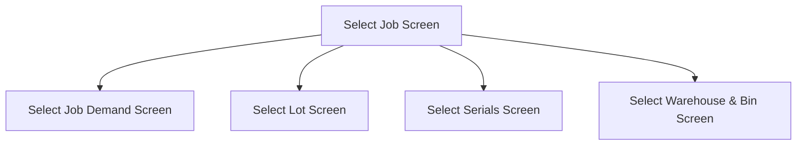

This screen is used to select a Job containing Job Demands

# Flow

If the [Selected Job](#job-number) is valid and contains more than one Demand Link
- The app will navigate to the [Select Job Demand Screen](./Select_Job_Demand_Screen.md)

Given that the [Selected Job](#job-number) is valid and contains only one Demand Link
- The app will automatically select that Demand Link
- If the Demand Link's Part is lot-tracked
	- The app will navigate to the [Select Lot Screen](./Select_Lot_Screen.md)
- If the Demand Link's Part is serial-tracked and not lot-tracked
	- The app will navigate to the [Select Serials Screen](./Select_Serials_Screen.md)
- If the Demand Link's Part is neither serial-tracked or lot-tracked
	- The app will navigate to the [Select Warehouse & Bin Screen](./Select_Warehouse_%26_Bin_Screen.md)

# When This Page Is Loaded
The following properties are removed from the [Application Storage](../../../Application_Storage.md)
- `SelectedJob`
- `SelectedJobDemand`
- `SerialNumbers`
- `SelectedWarehouse`
- `SelectedWarehouseBin`
- `SelectedLotNumber`
- `SelectedPartSerials`
- `SelectedQuantity`
- `PartTranPKs`

# Controls
## Job Number
This control is used to enter the Job Number of the Job that contains any Demands

## Scan
This control is used to scan the [Job Number](#job-number)

### When This Button Is Tapped
See [Camera Scanning](#camera-scanning)

## Select
This control is used to validate the selection and navigate to the next screen, as defined under [Flow](#flow)

### When This Button Is Tapped
The app will validate the selection

If the [Selected Job Number](#job-number) is empty
- An error with the message, "Please enter or scan a job number", is shown

The app will then try to get the Job from Epicor
- This is done via a REST call to `Erp.BO.JobEntrySvc/GetByID`

If the request is erroneous
- An error with the Epicor error message is shown

If the Job is not released
- An error with the message, "This job is not released. Please try another job", is shown

If the Job is complete
- An error with the message, "This job is complete. Please try another job", is shown

If the Job contains no demands
- An error with the message, "There are no demands assigned to this job", is shown

If the Job only contains demands that [are not supported](../Job_Receipts.md#supported-demand-types)
- An error with the message, "Only 'Job to Stock' and 'Job to Job' demands are supported", is shown

If the Job contains [Supported Demand Types](../Job_Receipts.md#supported-demand-types) that are complete
- An dialog with the message, "Job demand has already been met, are you sure you want to continue?"

If the user chooses "Yes"
- The app will navigate to the next screen as defined under [Flow](#flow)

If the user chooses "No"
- Validation will be marked as failed

# Scanning
## Camera Scanning
The [Camera Scanning Process](../../../Scanning.md#camera-scanning) is triggered to allow the user to scan a barcode

See [How The Scanned Barcode Is Handled](#how-the-scanned-barcode-is-handled)

## Data Wedge Scanning
When a barcode is scanned by a data wedge, the logic defined under [How The Scanned Barcode Is Handled](#how-the-scanned-barcode-is-handled) is followed

## How The Scanned Barcode Is Handled
The barcode is validated against the defined [Job Barcode Format](../../../Scanning.md#job-number)

If the barcode is invalid
- The relevant [Barcode Validation Error](../../../Scanning.md#barcode-validation-errors) will be shown to the user

The [Job Number](#job-number) is updated with the value of the barcode

Then the [Select Button Logic](#when-this-button-is-tapped-1) is followed