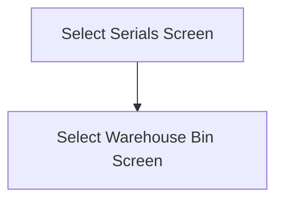

This screen is used to select the Serials for the selected Material's Part

This screen is only accessible by serial-tracked Parts

# Flow

# Controls
## Part Serials
This list shows all of the available serials that can be selected

The data for this list was collected when the app verified that the Serial Numbers matched
- Refer to [How MIMS Compares The Serial Number Count](../Epicor_Processes.md#how-mims-compares-the-serial-number-count) for further information

## Scan
This button is used to scan the serials with the device's camera

### When This Button Is Tapped
See [Camera Scanning](#camera-scanning)

## Select
This button will validate the selection and navigate to the next screen

### When This Button Is Tapped
The selection is validated

If no serials have been selected
- An error with the message, "Please choose at least one serial", will be shown to the user

The app will then follow the navigation logic defined under [Flow](#flow)

# Scanning
## Camera Scanning
The [Camera Scanning Process](../../../Scanning.md#camera-scanning) is triggered to allow the user to scan the serials

Then logic defined under [How The Scanned Barcode Is Handled](#how-the-scanned-barcode-is-handled) is followed

# Data Wedge Scanning
When a barcode is scanned by a data wedge, the logic defined under [How The Scanned Barcode Is Handled](#how-the-scanned-barcode-is-handled) is followed

# How The Scanned Barcode Is Handled
The barcode is validated against the defined [Serial Format](../../../Scanning.md#serial-format)

If the barcode is invalid:
- The relevant [Barcode Validation Error](../../../Scanning.md#barcode-validation-errors) will be shown to the user

Then the app will attempt to find the scanned serial from the list of [Serials](#part-serials)

If no serial is found:
- A toast with the message, "Serial 'SERIALNUMBER' not found. Try again", will be shown to the user
	- `SERIALNUMBER` being the serial number interpreted from the scanned barcode

If a serial is found:
- The found serial number will be selected and checked within the list of [Serials](#part-serials)
- A toast with the message, "Serial 'SERIALNUMBER' scanned", will be shown to the user
	- `SERIALNUMBER` being the serial number interpreted from the scanned barcode
