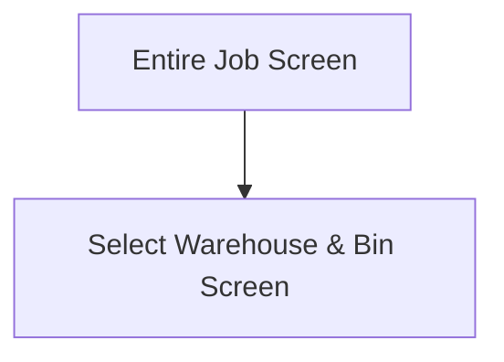

This screen will show a list of materials, to be issued, to the user

# Flow

- When the user selects a material from the [Material List](#material-list), the app navigates to the [Select Warehouse & Bin Screen](./Select_Warehouse_%26_Bin_Screen.md)

# Material Categories
The materials are grouped into the following categories:
- Materials To Return
- Returned Materials

## Materials To Return
Materials to return will show the following information, if available:
- Part Number
- Part Description
- Warehouse Code & Bin Number
- Quantity To Return

## Returned Materials
Returned Materials are shown for convenience and cannot be returned any further

These items are disabled and cannot be interacted with

Returned Materials will show the following information, if available:
- Part Number
- Part Description
- Warehouse Code & Bin Number
- Quantity that has been returned

# When This Page Is Loaded
The app filters the selected Job's materials for materials that need to be returned

This is determined by materials that match the following criteria
- `IssuedQty > 0`

These materials are then filtered by
- The selected assembly, if one was selected on the [Select Sub-Assembly Screen](./Select_Sub-Assembly_Screen.md)
- The selected operation, if one was selected on the [Select Operation Screen](./Select_Operation_Screen.md)
- The selected warehouse, if one was scanned on this screen

These materials are then ordered by
- The `WarehouseCode`
- Then the `MtlSeq`

The app then filters the selected Job's materials for materials that have been returned

This is determined by materials that match the following criteria
- `IssuedQty == 0`

These materials are then filtered by
- The selected assembly, if one was selected on the [Select Sub-Assembly Screen](./Select_Sub-Assembly_Screen.md)
- The selected operation, if one was selected on the [Select Operation Screen](./Select_Operation_Screen.md)
- The selected warehouse, if one was scanned on this screen

These materials are then ordered by
- The `WarehouseCode`
- Then the `MtlSeq`

# Controls
## Material List
*This is a custom control that displays a list of materials in specific categories*

This list shows the available materials on the Assembly / Operation grouped into the [Material Categories](#material-categories)

### When A Material To Be Returned Is Tapped
The selected material is updated in the [Application Storage](../../../Application_Storage.md)

The app then navigates to the [Select Warehouse & Bin Screen](./Select_Warehouse_%26_Bin_Screen.md), as defined in the [Flow](#flow)

## Scan Warehouse
This button can be used to further filter the materials by the scanned Warehouse

### When This Button Is Tapped...
The [Camera Scanning Process](../../../Scanning.md#camera-scanning) is triggered to allow the user to scan a Warehouse

See [How The Scanned Warehouse Barcode Is Handled](#how-the-scanned-warehouse-barcode-is-handled)

## Scan Part
This button can be used to select a material via the scanned Part Number

### When This Button Is Tapped...
See [Camera Scanning](#camera-scanning)

# Scanning
## Camera Scanning
The [Camera Scanning Process](../../../Scanning.md#camera-scanning) is triggered to allow the user to scan a barcode

See [How The Scanned Part Barcode Is Handled](#how-the-scanned-part-barcode-is-handled)

## Data Wedge Scanning
**NOTE: Only the Part can be scanned by the Data Wedge, the Warehouse scanning option is disabled if a Data Wedge is detected**

When a barcode is scanned by a data wedge, the logic defined under [How The Scanned Part Barcode Is Handled](#how-the-scanned-part-barcode-is-handled) is followed

## How The Scanned Part Barcode Is Handled
The barcode is validated against the defined [Part Format](../../../Scanning.md#part-format)

If the barcode is invalid:
- The relevant [Barcode Validation Error](../../../Scanning.md#barcode-validation-errors) will be shown to the user

Then the app will attempt to find the scanned material from the [Material List](#material-list)

If no material is found:
- An error with the message "Could not find the scanned part. " will be shown to the user

If a material is found:
* The [Material Tap Logic](#when-a-material-to-be-returned-is-tapped) is followed

## How The Scanned Warehouse Barcode Is Handled
The Selected Warehouse is updated in the [Application Storage](../../../Application_Storage.md)

The app will refresh and further filter the [Material List](#material-list), only showing parts:
* Under the selected assembly (if selected)
* Under the selected operation (if selected)
* Under the scanned warehouse code