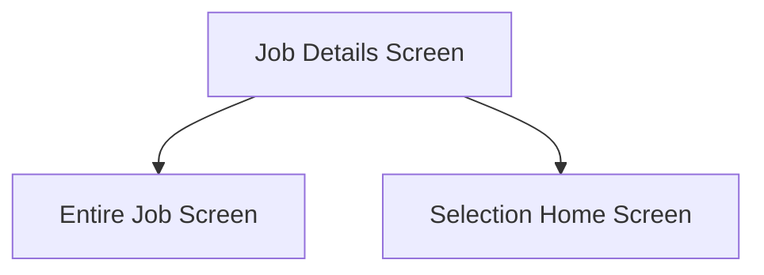

This screen is used to show details about the selected Job

This information includes:
- Job Number
- Part Number
- Part Description
- Production Quantity
- Job Type
- Start Date
	- **Or Required By Date if Start Date is not defined**
- Materials To Returns

# Flow

- If the user taps the [Entire Job Button](#entire-job), the app will navigate to the [Entire Job Screen](./Entire_Job_Screen.md)
- If the user taps the [Selection Button](#selection), the app will navigate to the [Selection Home Screen](./Selection_Home_Screen.md)

# Controls
## Entire Job
This button is used to navigate to the [Entire Job Screen](./Entire_Job_Screen.md)

### When This Button Is Tapped...
The `Selected Operation` and `Selected Assembly` is cleared in the [Application Storage](../../../Application_Storage.md)

The app navigates to the [Entire Job Screen](./Entire_Job_Screen.md)

## Selection
This button is used to filter the materials by Assembly and or Operation

This button is disabled if the job contains no valid assemblies or valid operations

A valid assembly is defined by the following criteria:
- The main assembly `(AssemblySeq = 0)` contains at least one material that
	- Aren't Issued Complete `(IssuedComplete == False)`
	- The material requires issuing `(RequiredQty - IssuedQty > 0)`

A valid operation is defined by the following criteria:
- The operation must be under the main assembly `(AssemblySeq = 0)`
- The operation isn't complete `(Complete == False)`
- The operation contains at least one material that:
	- Aren't Issued Complete `(IssuedComplete == False)`
	- The material requires issuing `(RequiredQty - IssuedQty > 0)`

## When This Button Is Tapped...
The `Selected Operations` and `Selected Assembly` is cleared from the [Application Storage](../../../Application_Storage.md)

The app navigates to the [Selection Home Screen](./Selection_Home_Screen.md)
