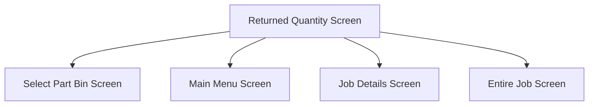

This screen allows the user to select the quantity of the part '../../../../Technical Documentation/Applets/Job Returns/Screens'they wish to return

This screen cannot be accessed by serial tracked parts

# Flow

- If the Job Material was partially Returned, the app will navigate to the [Select Warehouse & Bin Screen](./Select_Warehouse_%26_Bin_Screen.md)
- If the Job is entirely returned, the app will navigate to the [Home Page](../../Home_Page.md)
- If all Job Material's under the selected operation have been returned, the app will navigate to the [Job Details Screen](./Job_Details_Screen.md)
- If the Job Material was fully returned, the app will navigate to the [Entire Job Screen](./Entire_Job_Screen.md)

# When This Page Is Loaded
The app will automatically determine a default quantity to select

The selected quantity will be set to the selected Part's Issued Quantity

# Controls
## Selected Quantity
This control allows the user to enter a quantity of the part that they wish to return

This entry uses a numerical keyboard

## Issued Complete
This control allows the user to choose if they want to mark the transaction as Issued Complete

## Back
This control allows the user to navigate to the previous screen

### When This Button Is Tapped
The app will navigate to the previous screen

## Return
This button performs the material movement for the selected part

### When This Button Is Tapped
#### Validation
If the user has entered a quantity that is **less than zero**
- An error with the message, "You cannot return a negative quantity", is shown to the user

If the user has entered a quantity **of zero**
- An error with the message, "Please choose a quantity greater than 0", is shown to the user

#### Issue Material Transaction
After the selection has been successfully validated, the part is then issued to the Job Material
- This is done via a REST call to `~/Erp.BO.IssueReturnSvc/PerformMaterialMovement`

This call will issue the selected Part:
- From the selected Job Material
- To the selected Warehouse
- To the selected Part Bin
- To the selected Lot Number
- Using the selected [Issued Complete](#issued-complete) value

**If [AMM](../../../AMM_Handling.md) is not licensed**
- The `FromWarehouseCode` and `FromBinNum` parameters will not be set

**If [AMM](../../../AMM_Handling.md) is licensed** 
- The `FromWarehouseCode` and `FromBinNum` parameters will be set to the selected Warehouse and Part Bin

Once the material has been returned, the app will navigate to a screen based on the following logic 