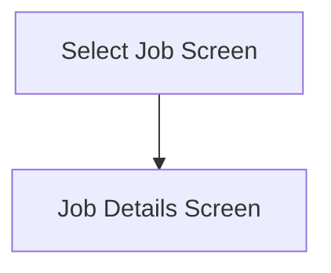

This screen is used to enter the Job Number of the Job to return issued materials from

# Flow

- Given that the user selects a valid Job, the app will navigate to the [Job Details Screen](./Job_Details_Screen.md)

# Toolbar
## Home Button
This button is used to navigate back to the [Home Page](../../Home_Page.md)

# Controls
## Job Number
This control is used to input the Job Number

## Scan
This control is used to scan the Job Number with the device's camera

### When This Button Is Tapped...
See [Camera Scanning](#camera-scanning)

## Select
This control is used to submit the Job Number and navigate to the [Job Details Screen](./Job_Details_Screen.md)

### When This Button Is Tapped...
If the [Job Number](#job-number) is empty
- An error with the message, "Please enter or scan a job number", is shown

Then the Job is retrieved from Epicor

If this is unsuccessful
- An error with the message, "Could not get job", is shown

If the retrieved Job contains no materials to return
- An error with the message, "This job has already been returned. ", is shown
- This is determined by the following
	- `IssuedQty` is greater than `0`

If the retrieved Job is not Release
- An error with the message, "This job is not released. Please try another job. ", is shown
- This is determined by the following
	- `JobReleased` is equal to `false`

If the retrieved Job is Complete
- An error with the message, "This job is complete. Please try another job. ". is shown
- This is determined by the following
	- `JobComplete` is equal to `true`

Given that all of the above was successful
- The app will navigate to next screen as defined by the logic under [Flow](#flow)

# Scanning
## Camera Scanning
The [Camera Scanning Process](../../../Scanning.md#camera-scanning) is started to retrieve the barcode

Then the logic defined under [How The Scanned Barcode Is Handled](#how-the-scanned-barcode-is-handled) is followed

## Data Wedge Scanning Process
When a barcode is scanned by a data wedge, the logic defined under [How The Scanned Barcode Is Handled](#how-the-scanned-barcode-is-handled) is followed

## How The Scanned Barcode Is Handled
The barcode is validated against the defined [Job Number Barcode Format](../../../Scanning.md#job-number)

If the barcode is invalid:
- The relevant [Barcode Validation Error](../../../Scanning.md#barcode-validation-errors) will be shown to the user

If the barcode is valid:
* The [Select Button Logic](#when-this-button-is-tapped-1) is Followed