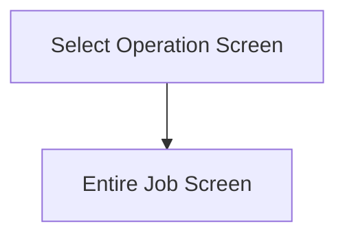

This screen is used to filter the materials shown on the [Entire Job Screen](./Entire_Job_Screen.md)

This page will also show the following details about the selected Job and selected Assembly
- Job Number
- Part Number
- Part Revision Number
- Selected Assembly Description

If the user had previously selected a sub-assembly on the [Select Sub-Assembly Screen](./Select_Sub-Assembly_Screen.md), the sub-assembly operations will be shown

If the user had navigated to this screen from the [Selection Home Screen](./Selection_Home_Screen.md), then the operations of the main-assembly will be shown

# Flow

Given that the user has selected a valid operation
- When the user taps the [Select Button](#select), the app will navigate to the [Entire Job Screen](./Entire_Job_Screen.md)

# When This Page Is Loaded...
The Selected Assembly's operations are filtered by the following criteria
- The operations must contain at least one material needs to be returned
	- `IssuedQty > 0`

If there is one operation, after the filtering, the app will:
- Set the Selected Operation to the operation, in the [Application Storage](../../../Application_Storage.md)
- Navigate to the [Entire Job Screen](./Entire_Job_Screen.md)

# Controls
## Operation
This control is used to select an operation for filtering the materials on the [Entire Job Screen](./Entire_Job_Screen.md)

## Scan
This button is used to allow the user to scan an operation with the device's camera

### When This Button Is Tapped...
See [Camera Scanning](#camera-scanning)

## Select
This button is used to validate the selection and navigate to the [Entire Job Screen](./Entire_Job_Screen.md)

### When This Button Is Tapped...
If no operation has been selected
- An error with the message, "Please select an operation", is shown

Then the app will navigate to the [Entire Job Screen](./Entire_Job_Screen.md)

# Scanning
## Camera Scanning
The [Camera Scanning Process](../../../Scanning.md#camera-scanning) is triggered to allow the user to scan a barcode

Then logic defined under [How The Scanned Barcode Is Handled](#how-the-scanned-barcode-is-handled) is followed

# Data Wedge Scanning
When a barcode is scanned by a data wedge, the logic defined under [How The Scanned Barcode Is Handled](#how-the-scanned-barcode-is-handled) is followed

# How The Scanned Barcode Is Handled
The barcode is validated against the defined [Operation Format](../../../Scanning.md#operation-format)

If the barcode is invalid:
- The relevant [Barcode Validation Error](../../../Scanning.md#barcode-validation-errors) will be shown to the user

Then the app will attempt to find the scanned operation from the list of [Operations](#operation)

If no operation is found:
- An error with the message "Operation not found" will be shown to the user

If an assembly is found:
* The [Select Button Logic](#when-this-button-is-tapped-1) is followed