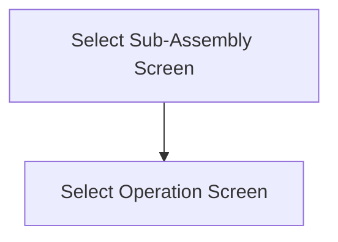

This screen is used to select a sub-assembly to filter the materials shown on the [Entire Job Screen](./Entire_Job_Screen.md)

This screen also show the following details of the current job:
- Job Number
- Part Number
- Part Revision Number

# Flow

When the user taps the [Select Button](#select)
- If the [Selected Assembly](#assembly) contains more than one Operation
	- The app will navigate to the [Select Operation Screen](./Select_Operation_Screen.md)

# When This Page Is Loaded...
The app gets the valid sub-assemblies from the selected Job

A valid sub-assembly is defined by the following criteria
- The sub-assembly is not the main Assembly
	- `AssemblySeq != 0`
- The assembly contains at least one material that needs to be returned
	- `IssuedQty > 0`

If the resulting assembly list contains only one sub-assembly
- The app will automatically select the sub-assembly
- The app will navigate to the [Select Operation Screen](./Select_Operation_Screen.md)

# Controls
## Assembly
This controls allows the user to select a sub-assembly to filter the materials on

## Scan
This button allows the user to scan a sub-assembly

### When This Button Is Tapped...
See [Camera Scanning](#camera-scanning)

The Selected [Assembly](#assembly) is updated to the value of the barcode

Then the [Selection Button Logic](#when-this-button-is-tapped-1) is followed

## Select
This button will validate the [Selected Assembly](#assembly) and navigate to the [Select Operation Screen](./Select_Operation_Screen.md)

### When This Button Is Tapped...
The app will check if an assembly has been selected

If no assembly has been selected
- An error with the message, "Please select an assembly", is shown

The app will navigate to the [Select Operation Screen](./Select_Operation_Screen.md)

# Scanning
## Camera Scanning
The [Camera Scanning Process](../../../Scanning.md#camera-scanning) is triggered to allow the user to scan a barcode

Then logic defined under [How The Scanned Barcode Is Handled](#how-the-scanned-barcode-is-handled) is followed

## Data Wedge Scanning
When a barcode is scanned by a data wedge, the logic defined under [How The Scanned Barcode Is Handled](#how-the-scanned-barcode-is-handled) is followed

## How The Scanned Barcode Is Handled
The barcode is validated against the defined [Assembly Format](../../../Scanning.md#assembly-format)

If the barcode is invalid:
- The relevant [Barcode Validation Error](../../../Scanning.md#barcode-validation-errors) will be shown to the user

Then the app will attempt to find the scanned assembly from the list of [Assemblies](#assembly)

If no assembly is found:
- An error with the message "The scanned barcode does not match any assemblies for this job" will be shown to the user

If an assembly is found:
* The [Select Button Logic](#when-this-button-is-tapped-1) is followed