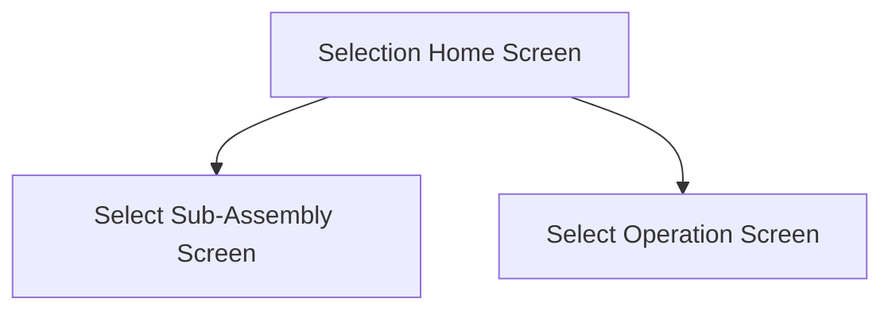

This screen is used to filter the material selection

This can be done by selecting an assembly or operation

This will then navigate to the [Select Sub-Assembly Screen](./Select_Sub-Assembly_Screen.md) or the [Select Operation Screen](./Select_Operation_Screen.md)

# Flow

- If the user taps the [Select Sub-Assembly Button](#select-sub-assembly)
	- The app navigates to the [Select Sub-Assembly Screen](./Select_Sub-Assembly_Screen.md)
- If the user taps the [Select Operation Button](#select-operation)
	- The app navigates to the [Select Operation Screen](./Select_Operation_Screen.md)

# When This Page Is Loaded...
The [Select Sub-Assembly Button](#select-sub-assembly) is disabled if [the following criteria is not met](#this-button-is-disabled-if)

The [Select Operation Button](#select-operation) is disabled if [the following criteria is not met](#this-button-is-disabled-if-1)

# Controls
## Select Sub-Assembly
This button can be used to navigate to the [Select Sub-Assembly Screen](./Select_Sub-Assembly_Screen.md)

### This Button Is Disabled If...
This button is disabled if none of the assemblies meet the following criteria
- The assembly must not be the main assembly 
	- `AssemblySeq != 0`
- The assembly contains at least one material that needs to be returned
	- `IssuedQty > 0`

### When This Button Is Tapped...
The selected assembly is cleared from the [Application Storage](../../../Application_Storage.md)

The app navigates to the [Select Sub-Assembly Screen](./Select_Sub-Assembly_Screen.md)

## Select Operation
This button can be used to navigate to the [Select Operation Screen](./Select_Operation_Screen.md)

### This Button Is Disabled If...
This button is disabled if the none of the operations meet the following criteria
- The operation is a part of the main assembly
- The operation contains at least one material that needs to be returned
	- `IssuedQty > 0`

### When This Button Is Tapped...
The selected operation is cleared from the [Application Storage](../../../Application_Storage.md)

The selected assembly is set the the job's main assembly in the [Application Storage](../../../Application_Storage.md)

Then the app navigates to the [Select Operation Screen](./Select_Operation_Screen.md)