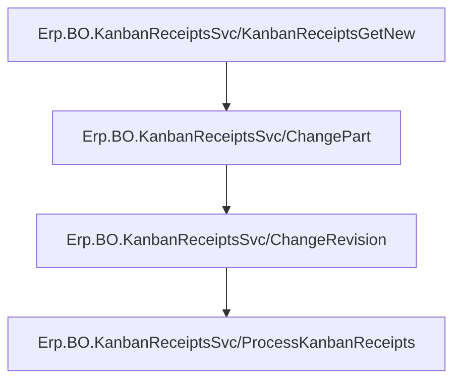
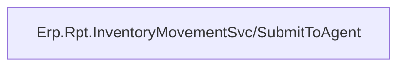

# Creating The Kanban Receipt
The following API calls are made in the following order

A call is made to `~/Erp.BO.KanbanReceiptsSvc/KanbanReceiptsGetNew` to get a new dataset for the Kanban receipt

Then a call is made to `~/Erp.BO.KanbanReceiptsSvc/ChangePart` to bring in default information for the selected Part

Then a call is made to `~/Erp.BO.KanbanReceiptsSvc/ChangeRevision` to bring in default information for the selected Part Revision

Finally a call is made to `~/Erp.BO.KanbanReceiptsSvc/ProcessKanbanReceipts` to create the Kanban Receipts

# Printing
## Getting The Transaction
The following API calls are made in the following order

This is done to generate the primary keys that Epicor uses for Part Transactions
- `SysDate`~`SysTime`~`TranNum`

## Submitting The Report
The following API calls are made in the following order

- Refer to [How MIMS Creates Reports In Epicor](../../Printing.md#how-mims-creates-reports-in-epicor) for additional information about this REST call
- This is done using the primary keys generated from [Getting The Transaction](./Epicor_Processes.md#getting-the-transaction)
