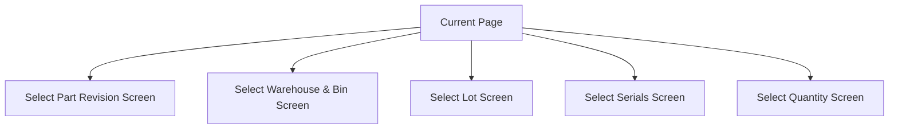

# Selection Flow

If the selected Part Revision has not been chosen
- The app will navigate to the [Select Part Revision Screen](./Screens/Select_Part_Revision_Screen.md)

If the selected Warehouse & Bin has not been chosen
- The app will navigate to the [Select Warehouse & Bin Screen](./Screens//Select_Warehouse_%26_Bin_Screen.md)

If the selected Part is lot-tracked and a lot number has not been chosen
- The app will navigate to the [Select lot Screen](./Screens/Select_Lot_Screen.md)

If the selected Part is serial-tracked and no serial numbers have been chosen
- The app will navigate to the [Select Serials Screen](./Screens/Select_Serials_Screen.md)

Otherwise
- The app will navigate to the [Selected Quantity Screen](./Screens//Select_Quantity_Screen.md)