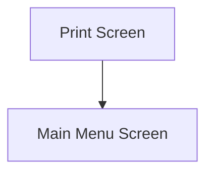

This screen is used to print the details of the performed Receipt

# Flow

# When This Page Is Loaded
The printers are retrieved from Epicor
- See [How MIMS Retrieves The Available Printers](../../../Printing.md#how-mims-retrieves-the-available-printers)

The [Selected Printer](#printers) is set to the first default Printer

# Controls
## Printers
This control is used to select a Printer from the list of available Printers

## Don't Print
This control is used to skip printing and navigate to the [Home Screen](../../Home_Page.md)

### When This Button Is Tapped
The app navigates to the [Home Screen](../../Home_Page.md), as defined under [Flow](#flow)

## Print
This control is used to print the Receipt

### When This Button Is Tapped
The app validates the selection

If no [Printer](#printers) has been selected
- An error with the message, "Please select a printer", is shown to the user

The report is created within Epicor
- See [Printing](../Epicor_Processes.md#printing)

The following properties are removed from [Application Storage](../../../Application_Storage.md)
- `SelectedPart`
- `SelectedPartRevision`
- `SelectedPartBin`
- `SelectedLotNumber`
- `SelectedSerials`
- `KanbanJobNum`

The app then navigates to the [Home Screen](../../Home_Page.md), as defined under [Flow](#flow)