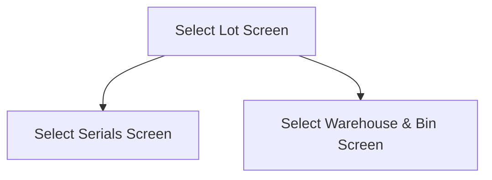

This screen is used to select a Lot

# Flow

- If the material's part **is Serial Tracked**, the app will navigate to the [Select Serials Screen](./Select_Serials_Screen.md)
- If the material's part **is not Serial Tracked**, the app will navigate to the [Select Warehouse & Bin Screen](./Select_Warehouse_%26_Bin_Screen.md)

# When This Page Is Loaded
The Lot Numbers, for the selected Part, are retrieved from Epicor
- This is done via a REST call to `~/Erp.BO.LotSelectUpdateSvc/LotSelectUpdates`

The app will set the [Selected Lot Number](#lot-number) to the first result from the result

# When This Page Is Unloaded
The following properties will be removed from the [Application Storage](../../../Application_Storage.md)
- `SelectedSerials`
- `KanbanJobNum`

# Controls
## Lot Number
This control is used to enter the Lot Number to receipt to

## Scan
This control is used to scan the [Lot Number](#lot-number) with the device's camera

### When This Button Is Tapped
See [Camera Scanning](#camera-scanning)

## Next Lot
This button will generate the next lot number for the selected Part and automatically select it

### When This Button Is Tapped...
A REST call is made to `~/Erp.BO.LotSelectUpdateSvc/GenerateNewLotNum` to generate the next Lot Number

This new Lot Number is then set as the selected [Lot Number](#lot-number)

## Select
This control validates the current selection and then navigates to the next screen as defined under [Flow](#flow)

### When This Button Is Tapped
The app checks that a Lot Number has been selected
- If no Lot Number has been selected, an error with the message "Please select a Lot" will be shown to the user

Otherwise, the app will follow the navigation logic as defined in the [Flow](#flow)

# Scanning
## Camera Scanning
The [Camera Scanning Process](../../../Scanning.md#camera-scanning) is triggered to allow the user to scan a barcode

Then logic defined under [How The Scanned Barcode Is Handled](#how-the-scanned-barcode-is-handled) is followed

## Data Wedge Scanning
When a barcode is scanned by a data wedge, the logic defined under [How The Scanned Barcode Is Handled](#how-the-scanned-barcode-is-handled) is followed

## How The Scanned Barcode Is Handled
The barcode is validated against the defined [Lot Format](../../../Scanning.md#lot-format)

If the barcode is invalid:
- The relevant [Barcode Validation Error](../../../Scanning.md#barcode-validation-errors) will be shown to the user

Then the app will set the [Selected Lot Number](#lot-number) to the value of the barcode

Then the [Select Button Logic](#when-this-button-is-tapped-2) is followed