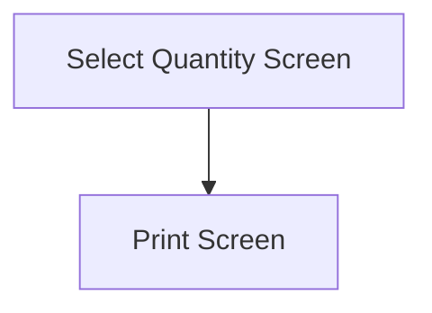

This screen is used to select the Quantity for the Kanban Receipt

This screen will display the following information about the Kanban Receipt
- The Selected Part Number
- The Selected Warehouse Description
- The Selected Bin Description

If the Selected Part is lot-tracked, the following information will also be shown
- The Selected Lot Number

If the Selected Part is serial-tracked, the following information will also be shown
- The Selected Serial Count

# Flow

# When This Page Is Loaded
If the Selected Part is lot-tracked
- The [Selected Quantity](#quantity) will be set the the number of Selected Serials
- The [Quantity Control](#quantity) will be disabled

Otherwise
- The [Quantity Control](#quantity) will be enabled

# Controls
## Quantity
This control is used to enter the Quantity of the Kanban Receipt

## Create
This button is used to create the Kanban Receipt

### When This Button Is Tapped
The selection is validated

If the [Selected Quantity](#quantity) is zero
- An error with the message, "Please enter a quantity greater than 0", is shown

The app will then create the Kanban Receipt in Epicor

The app will then follow the navigation logic defined under [Flow](#flow)
