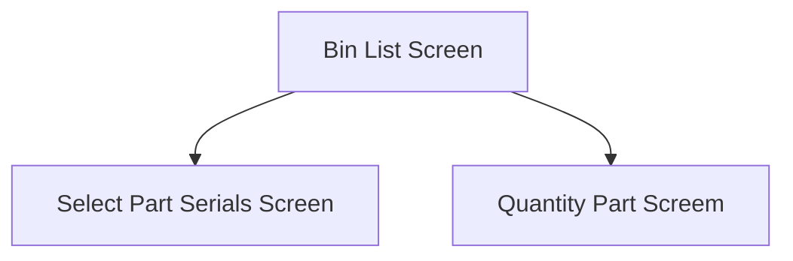

This screen is used to select a Part Bin for the selected Part

# Flow

Given that the [Selected Part Bin](#part-bin-list) is for a serial-tracked part
 - The app will navigate to the [Select Part Serials Screen](./Select_Part_Serials_Screen.md)

Given that the [Selected Part Bin](#part-bin-list) is for a non-serial tracked part
 - The app will navigate to the [Quantity Part Screen](./Quantity_Part_Screen.md)

# When This Page Is Loaded
The app retrieves the Part Bins from Epicor

If the selected Part is not lot-tracked, the Part Bins are retrieved from Epicor using the Part Number
- This is done via a REST call to `~/Erp.BO.PartBinSearchSvc/GetPartBinByLotAndPlant`

If the selected Part is lot-tracked, the Part Bins are retrieved from Epicor using the Lot Number
- This is done via a REST call to `~/Erp.BO.PartBinSearchSvc/GetPartBinByLotAndPlant`

The app will then update the selected quantities of the Part Bins
- This happens after navigating back to this page from selecting a Quantity or Serials

# Controls
## Part Bin List
This control is used to select a Part Bin from the list of retrieved Part Bins for the selected Part

### When A Part Bin Is Tapped
The app will save the selected Part Bin in the [Application Storage](../../../Application_Storage.md)

The app will then navigate to the next screen as defined under [Flow](#flow)

# Scanning
## Camera Scanning
Camera scanning is not supported on this page

## Data Wedge Scanning
When a barcode is scanned by a data wedge, the logic defined under [How The Scanned Barcode Is Handled](#how-the-scanned-barcode-is-handled) is followed

## How The Scanned Barcode Is Handled
The barcode is validated against the defined [Warehouse Bin Format](../../../Scanning.md#warehouse-bin-format)

If the barcode is invalid:
- The relevant [Barcode Validation Error](../../../Scanning.md#barcode-validation-errors) will be shown to the user

Then the app will attempt to find the scanned material from the [Part Bin List](#part-bin-list)

If no Part Bin is found:
- An error with the message "Bin '{Bin}' does not exist in warehouse '{warehouse}'" will be shown to the user
	- Where `{bin}` is the Bin Number interpreted from the barcode
	- Where `{warehouse}` is the Warehouse Code interpreted from the barcode

If a Part Bin is found:
* The [Part Bin Tapped](#when-a-part-bin-is-tapped) is followed