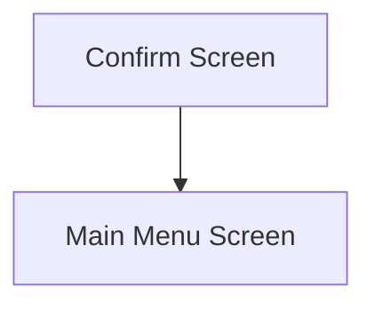

This screen is used to confirm the selection before performing the stock movement

This screen will display the following information
- The description of the Warehouse, that the selected Part will be moved **from**
- The description of the Bin, that the selected Part will be moved **from**
- The description of the Warehouse, that the selected Part will be moved **to**
- The description of the Bin, that the selected Part will be moved **to**

This screen will also display a list of the selected Part Bins, containing the following information
- The Part Number
- The Quantity On Hand
- The Part's UOM
- The Part Description
- The selected Quantity
- The selected UOM
- The Lot Number (If the part is lot-tracked)

# Flow

Given that the stock movement was successful
- The app will navigate to the [Home Page](../../Home_Page.md)

# Controls
## Move
This control is used to perform the stock movement

### When This Button Is Tapped
The app will perform the material movement in Epicor
- See [Stock Movement](../Epicor_Processes.md#stock-movement) for further information

The app will clear the used properties, throughout the applet, from [Application Storage](../../../Application_Storage.md)
- `Part`
- `PartLot`
- `PartSerial`
- `FromBin`
- `ToBin`
- `BinParts`
- `PartBins`
- `BinPartSerial`
- `SavedSerials`
- `IssuedSerials`

Then the app will navigate to the next screen as defined under [Flow](#flow)