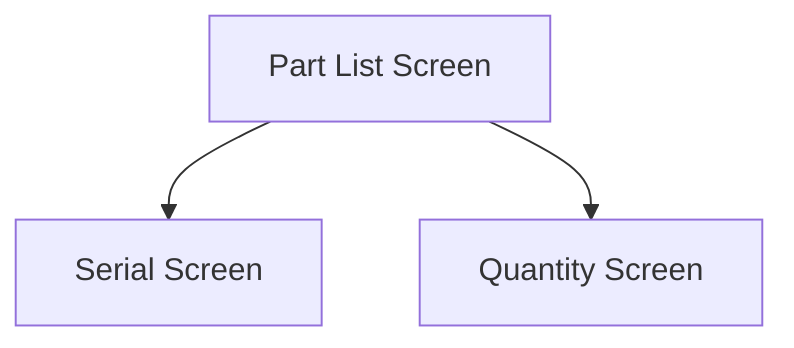

This screen is used to display the Parts found within the selected Warehouse and Bin

# Flow

Given that the selected Part is serial-tracked
- The app will navigate to the [Serial Screen](./Serial_Screen.md)

Given that the selected Part is not serial-tracked
- The app will navigate to the [Quantity Screen](./Quantity_Part_Screen.md)

# When This Page Is Loaded
The app checks the [Application Storage](../../../Application_Storage.md) for the current list of Bin Parts, containing the selected quantities

If the Bin Parts are found, the [Part List](#part-list) is updated with the found list of Bin Parts
- The app will also apply the selected Serials to the selected Quantity (if the Part is serial-tracked)

If nothing is found, the app will get the Part's from Epicor
- This is done via a REST call to `~/Erp.BO.PartBinSearchSvc/GetBinContents`
- The [Part List](#part-list) is updated with the retrieved Bin Parts

# Controls
## Part List
This control will display all the found Parts, in a list, containing the following information
- Part Number
- Available Quantity
- UOM
- Description
- Lot Number (if lot-tracked)
- Selected Quantity

### When A Part Is Tapped
The app will saved the selected Part in the [Application Storage](../../../Application_Storage.md)

Then the app will navigate to the next screen as defined under [Flow](#flow)

## Scan
This control is used to scan the Part using the device's camera

### When This Button Is Tapped
See [Camera Scanning](#camera-scanning)

# Scanning
## Camera Scanning
The [Camera Scanning Process](../../../Scanning.md#camera-scanning) is triggered to allow the user to scan a barcode

Then logic defined under [How The Scanned Barcode Is Handled](#how-the-scanned-barcode-is-handled) is followed

## Data Wedge Scanning
When a barcode is scanned by a data wedge, the logic defined under [How The Scanned Barcode Is Handled](#how-the-scanned-barcode-is-handled) is followed

## How The Scanned Barcode Is Handled
The barcode is validated against the defined [Part Format](../../../Scanning.md#part-format)

If the barcode is invalid:
- The relevant [Barcode Validation Error](../../../Scanning.md#barcode-validation-errors) will be shown to the user

Then the app will attempt to find the scanned Part from the [Part List](#part-list)

If no Part is found:
- An error with the message "Part '{PART}' not found", will be shown to the user
	- Where `{PART}` is the Part Number interpreted from the barcode

If a Part is found:
* The [Part Tap Logic](#when-a-part-is-tapped) is followed