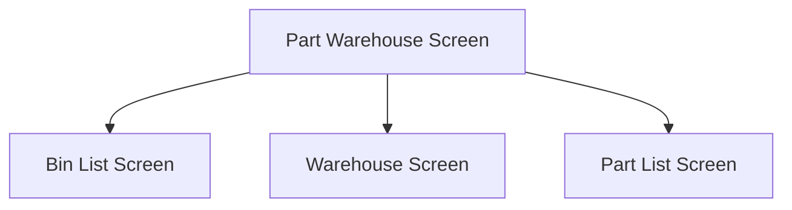

This screen is used to either
- Enter a Part to move
- Enter a Warehouse Bin to find parts to move

# Flow

Given that the user taps the [Select Button](#select) with a valid [Part Number](#part-number) entered
- The app will navigate to the [Bin List Screen](./Bin_List_Screen.md)

Given that the user scans a valid barcode that contains a Serial Number
- The app will navigate to the [Warehouse Screen](./Warehouse_Screen.md)

Given that the user taps the [Select Button](#select) with no [Part Number](#part-number) but a valid [Warehouse](#warehouse) and [Bin](#bin) entered
- The app will navigate to the [Part List Screen](./Part_List_Screen.md)

# When This Page Is Loaded...
A list warehouses, from the current Site, is retrieved from Epicor
- This is done via the REST call `~/Erp.BO.WarehseSearchSvc/GetList`

This list of Warehouses is then populated into the [Warehouse](#warehouse) picker for selection

# Toolbar
## Help Button
When this button is pressed, help for scanning this page is shown to the user

## Home Button
When this button is pressed, the app will navigate back to the [Home Page](../../Home_Page.md)

# Controls
## Part Number
This control is used to enter the Part Number of the Part to be moved

## Warehouse
This control is used to select a Warehouse from the current site

### When A Warehouse Is Selected...
The Bins within the selected [Warehouse](#warehouse) are retrieved from Epicor
- Initially, this is done via a REST call to `~/BaqSvc/GHA_MIMS_Bins`
- Otherwise, this is done via a REST call to `~/Erp.BO.WhseBinSvc/WhseBins`
	- This method will be chosen if the BAQ method fails or the BAQ doesn't exist

This list of bins is then populated into the [Bin](#bin) control

The [Bin](#bin) control is then enabled

## Bin
This control is used to select a Bin from the [Selected Warehouse](#warehouse)

Initially, this control is disabled until the user selects a [Warehouse](#warehouse)

## Scan
This button is used to scan the [Part Number](#part-number), [Warehouse](#warehouse) and [Bin](#bin) controls

### When This Button Is Tapped
See [Camera Scanning](#camera-scanning)

## Select
This button is used to complete the selection and navigate to the 

### When This Button Is Tapped
The app will attempt to get the [Selected Part](#part-number) from Epicor

Then the app will navigate to the next screen as defined under [Flow](#flow)

# Scanning
## Camera Scanning
The [Camera Scanning Process](../../../Scanning.md#camera-scanning) is triggered to allow the user to scan a barcode

Then logic defined under [How The Scanned Barcode Is Handled](#how-the-scanned-barcode-is-handled) is followed

## Data Wedge Scanning
When a barcode is scanned by a data wedge, the logic defined under [How The Scanned Barcode Is Handled](#how-the-scanned-barcode-is-handled) is followed

# How The Scanned Barcode Is Handled
The format of the barcode is then determined from one of the following formats:
- `PartNum`
- `PartNum~LotNum`
- `PartNum~SerialNum`
- `PartNum~LotNum~SerialNum`
- `SerialNum`
- `WarehouseCode`
- `WarehouseCode~BinNum`

If none of the above formats, or more than one of the above formats are found:
- An error with the message, "Scanned value is ambiguous {message} - please adjust manually", will be shown
	- Where `{message}` is the ambiguous result message

If the barcode format was `PartNum`:
- The app will get the Part from Epicor and save it to [Application Storage](../../../Application_Storage.md)
	- This is done via a REST call to `~/Erp.BO.PartSvc/Parts`
- The app will navigate to the [Bin List Screen](./Bin_List_Screen.md)

If the barcode format was `PartNum~LotNum`:
- The app will get the Part and Lot from Epicor and save it to [Application Storage](../../../Application_Storage.md)
	- This is done via a REST call to `~/Erp.BO.LotSelectUpdateSvc/LotSelectUpdates(Company, PartNum, LotNum)`
- The app will navigate to the [Bin List Screen](./Bin_List_Screen.md)

If the barcode format was `PartNum~SerialNum`
- The app will get the Part and Serial from Epicor and save it to [Application Storage](../../../Application_Storage.md)
	- This is done via a REST call to `~/Erp.BO.SerialNoSvc/SerialNoes(Company, PartNum, SerialNum)`
- The app will validate the Serial's Bin
	- This is done via a REST call to `~/Erp.BO.WhseBinSvc/WhseBins(Company, Warehouse, Bin)`
- The app will then get the Part via the Part Number
	- This is done via a REST call to `~/Erp.BO.PartSvc/Parts`
- The app will then navigate to the [Warehouse Screen](./Warehouse_Screen.md)

If the barcode format was `PartNum~LotNum~SerialNum`
- The app will get the Part, Lot and Serial from Epicor and save it to [Application Storage](../../../Application_Storage.md)
	- This is done via a REST call to `~/Erp.BO.LotSelectUpdateSvc/LotSelectUpdates(Company, PartNum, LotNum)`
	- And `~/Erp.BO.SerialNoSvc/SerialNoes(Company, PartNum, SerialNum)`
- The app will validate the Serial's Bin
	- This is done via a REST call to `~/Erp.BO.WhseBinSvc/WhseBins(Company, Warehouse, Bin)`
- The app will then get the Part via the Part Number
	- This is done via a REST call to `~/Erp.BO.PartSvc/Parts`
- The app will then navigate to the [Warehouse Screen](./Warehouse_Screen.md)

If the barcode format was `SerialNum`
- The app will get the Serial from Epicor and save it to [Application Storage](../../../Application_Storage.md)
	- This is done via a REST call to `~/Erp.BO.SerialNoSvc/List`
- The app will check if the serial number is associated with more than one part
	- If the serial number is associated with more than one part
		- An error with the message, "Serial number associated with more than one part - not yet implemented", is shown
- The app will validate the Serial's Bin
	- This is done via a REST call to `~/Erp.BO.WhseBinSvc/WhseBins(Company, Warehouse, Bin)`
- The app will then get the Part via the Part Number
	- This is done via a REST call to `~/Erp.BO.PartSvc/Parts`
- The app will then navigate to the [Warehouse Screen](./Warehouse_Screen.md)

If the barcode format was `WarehouseCode`
- The app will get the Warehouse from Epicor and save it to [Application Storage](../../../Application_Storage.md)
	- This is done via a REST call to `~/Erp.BO.WarehseSearchSvc/GetList`
- The app will find the Warehouse from the [Warehouse List](#warehouse) and select it
- The app will then get the Bins for the selected Warehouse
	- See [When A Warehouse Is Selected](#when-a-warehouse-is-selected) for further information

If the barcode format was `WarehouseCode~BinNum`
- The app will get the Warehouse and Bin from Epicor and save it to [Application Storage](../../../Application_Storage.md)
	- This is done via a REST call to `~/Erp.BO.WhseBinSvc/WhseBins(Company, Warehouse, Bin)`
- The app will then navigate to the [Part List Screen](./Part_List_Screen.md)