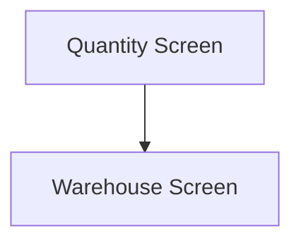

This screen is used to enter the quantity, to move, of the selected Part

This screen cannot be accessed if the selected Part is serial tracked

This page will display
- The Part Number of the selected Part
- The Code of the selected Warehouse
- The Number of the selected Bin
- The Number of the selected Lot (if the selected Part is lot-tracked)
- The available quantity of the selected Part Bin
- The UOM of the selected Part

# Flow

Given that the user has entered a valid quantity
- The app will navigate to the [Warehouse Screen](./Warehouse_Screen.md)

# Controls
## Quantity
This control is used to enter the quantity of the selected Part to move

## Select All
This control is used to select all of the available quantity

### When This Button Is Tapped
The app will set the [Selected Quantity](#quantity) to the available quantity of the selected Part Bin

## Done
This control is used to validate and complete the selection before navigating to the next screen

### When This Button Is Tapped
The app will validate the selection

If the selected quantity is greater than the available quantity of the Part Bin
- An error with the message, "You cannot issue more than the quantity on hand", is shown

If the selected quantity contains more decimal places than the selected Part's UOM
- And error with the message, "UOM {UOM} can have no more than {Decimal Places} decimal places", is shown
	- Where `{UOM}` is the UOM of the selected Part
	- Where `{Decimal Places}` is the number of decimal places of the `{UOM}`

The app will then save the [Selected Quantity](#quantity) to the [Application Storage](../../../Application_Storage.md)

The app will then navigate to the next screen as defined under [Flow](#flow)