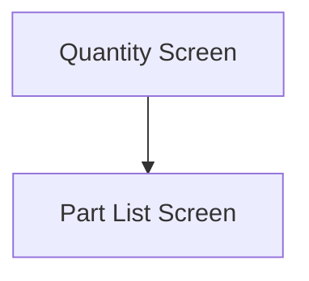

This screen is used to enter the quantity of the selected Part to move

This screen will display the following information
- The selected Part's Part Number
- The selected Warehouse's Warehouse Code
- The selected Bin's Bin Number
- The selected Lot's Lot Number (if lot-tracked)
- The selected Bin's available Quantity
- The selected Part's UOM

# Flow

Given that the selection is valid
- The app will navigate to the [Part List Screen](./Part_List_Screen.md)

# When This Page Is Loaded

# Controls
## Quantity
This control is used to enter the quantity of the selected Part to move

## Select All
This control is used to select all of the selected Bin's available quantity

### When This Button Is Tapped
The [Selected Quantity](#quantity) is set to the selected Bin's available quantity

## Done
This control is used to validate and complete the selection before navigating to the next screen

### When This Button Is Tapped
The app will validate the selection

If the [Selected Quantity](#quantity) is greater than the selected Bin's available quantity
- An error with the message, "You cannot issue more than the quantity on hand", is shown

If the decimal places of the [Selected Quantity](#quantity) is greater that the selected Part's UOM
- An error with the message, "UOM {UOM} can have no more than {Decimal Places} decimal places", is shown
	- Where `{UOM}` is the selected Part's UOM
	- Where `{Decimal Places}` is the number of decimal places of the selected Part's UOM

The app will then navigate to the next screen as defined under [Flow](#flow)