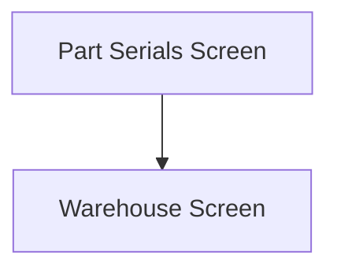

This screen is used to select the serials of the selected Part to move

# Flow

Given that the User has selected at least one serial number
- The app will navigate to the [Warehouse Screen](./Warehouse_Screen.md)

# When This Page Is Loaded
The app will retrieve the selected Part's Serials from Epicor

If the selected Part is lot-tracked, the serials are retrieved using the selected Part's Lot Number
- This is done via a REST call to `~/Erp.BO.SerialNoSvc/List`

If the selected Part is not lot-tracked, the serials are retrieved using the selected Part's Part Number
- This is done via a REST call to `~/Erp.BO.SerialNoSvc/List`

# Controls
## Part Serial List
This control displays a list of Serial numbers that the User can select

## Scan
This control is used to scan the serials using the device's camera

### When This Button Is Tapped
See [Camera Scanning](#camera-scanning)

## Select
This control is used to validate the selection and navigate to the next page

### When This Button Is Tapped
The app will validate the selection

If no serials have been selected
- The app will not navigate to the next page

The app will save the selected serials to the [Application Storage](../../../Application_Storage.md)

Then the app will navigate to the next screen as defined under [Flow](#flow)

# Scanning
## Camera Scanning
The [Camera Scanning Process](../../../Scanning.md#camera-scanning) is triggered to allow the user to scan the serials

Then logic defined under [How The Scanned Barcode Is Handled](#how-the-scanned-barcode-is-handled) is followed

# Data Wedge Scanning
When a barcode is scanned by a data wedge, the logic defined under [How The Scanned Barcode Is Handled](#how-the-scanned-barcode-is-handled) is followed

# How The Scanned Barcode Is Handled
The barcode is validated against the defined [Serial Format](../../../Scanning.md#serial-format)

If the barcode is invalid:
- The relevant [Barcode Validation Error](../../../Scanning.md#barcode-validation-errors) will be shown to the user

Then the app will attempt to find the scanned serial from the list of [Serials](#part-serial-list)

If no serial is found:
- A toast with the message, "Serial 'SERIALNUMBER' not found. Try again", will be shown to the user
	- `SERIALNUMBER` being the serial number interpreted from the scanned barcode

If a serial is found:
- The found serial number will be selected and checked within the list of [Serials](#part-serial-list)
* A toast with the message, "Serial 'SERIALNUMBER' scanned", will be shown to the user
	* `SERIALNUMBER` being the serial number interpreted from the scanned barcode
