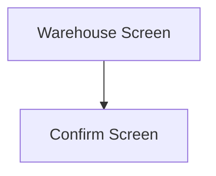

This screen is used to select a Warehouse and Bin to send the selected Part to

This page will display the following information
- The selected Part Number
- The selected Lot Number
- The selected Serial Number

# Flow

Given that the selection is valid
- The app will navigate to the [Confirm Screen](./Confirm_Screen.md)

# When This Page Is Loaded
The app will retrieve the Warehouses from Epicor

If the selected Part was selected from a Bin
- This is done via a REST call to `~/Erp.BO.PartWhseSearchSvc/List`
	- The Part Number is used as a filter

If the selected Part was not selected from a Bin
- This is done via a REST call to `~/Erp.BO.WarehseSearchSvc/GetList`

# Controls
## Warehouse
This control is used to select a Warehouse

### When A Warehouse Is Selected
The Bins from that Warehouse are retrieved from Epicor

Initially, the app attempts to retrieve the Bins using the [GHA_MIMS_Bins](../../../Epicor/BAQs/GHA_MIMS_Bins.md)
- This is done via a REST call to `~/BaqSvc/GHA_MIMS_Bins`

If the BAQ does not exist, the Bins are retrieved using the `WhseBinSvc` service
- This is done via a REST call to `~/Erp.BO.WhseBinSvc/WhseBins`
- Ignoring Supplier Managed Bins 
	- `BinType != "Supp"`

If no bins are found
- An error with the message, "Could not find any bins within this warehouse", will be shown

## Bin
This control is used to select a Bin from the selected Warehouse

## Scan
This control is used to scan the Warehouse and Bin using the device's camera

### When This Button Is Tapped
See [Camera Scanning](#camera-scanning)

## Select
This control is used to validate the selection and navigate to the next screen, following the logic defined under [Flow](#flow)

### When This Button Is Tapped
The app validates the selection by checking the selected Warehouse and Bin in Epicor
- This is done via a REST call to `~/Erp.BO.PartWhseSearchSvc/List`

If the REST call returns no results
- An error with the message "Warehouse does not exist for parts: {PARTS}", is shown
	- Where `{PARTS}` is a list of the parts that were searched for

Then the app saves the [Selected Warehouse](#warehouse) and the [Selected Bin](#bin) to the [Application Storage](../../../Application_Storage.md) as the "To Bin"

Then the app navigates to the next screen, following the logic defined under [Flow](#flow)

# Scanning
## Camera Scanning
The [Camera Scanning Process](../../../Scanning.md#camera-scanning) is triggered to allow the user to scan a barcode

Then logic defined under [How The Scanned Barcode Is Handled](#how-the-scan-result-is-handled) is followed

## Data Wedge Scanning
When a barcode is scanned by a data wedge, the logic defined under [How The Scanned Barcode Is Handled](#how-the-scan-result-is-handled) is followed

## How The Scan Result Is Handled
### If The [Warehouse Control](#warehouse) Is Focused
The app will try to find the first [Warehouse](#warehouse) where the  `WarehouseCode` is equal to the barcode

If no Warehouse is found
- An error with the message, "Could not find Warehouse '{barcode}'", is shown
	- Where `{barcode}` is the value of the scanned barcode

### If The [Bin Control](#bin) Is Focused
The app will try to find the first [Bin](#bin) where the `BinNum` is equal to the barcode

if no Bin is found
- An error with the message, "Could not find '{barcode}' in '{warehouse}'", is shown
	- Where `{barcode}` is the value of the scanned barcode
	- Where `{warehouse}` is the description of the [Selected Warehouse](#warehouse)

### If No Control Is Focused
The barcode is validated against the defined [Warehouse Bin Format](../../../Scanning.md#warehouse-bin-format)

If the barcode is invalid:
- The relevant [Barcode Validation Error](../../../Scanning.md#barcode-validation-errors) will be shown to the user

The app will try to find the first [Warehouse](#warehouse) and [Bin](#bin)

If the [Warehouse](#warehouse) could not be found
- An error with the message, "Could not find Warehouse '{warehouse}'", is shown
	- Where `{warehouse}` is the interpreted Warehouse Code from the barcode

If the [Bin](#bin) could not be found
- An error with the message, "Could not find Bin '{bin}' in '{warehouse}'", is shown
	- Where `{bin}` is the interpreted Bin Number from the barcode
	- Where `{warehouse}` is the Warehouse Code of the scanned Warehouse

If the [Warehouse](#warehouse) and [Bin](#bin) is found:
* The [Select Button Logic](#when-this-button-is-tapped-1) is followed