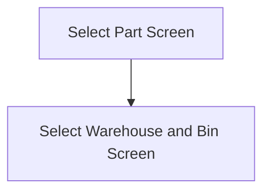

This screen is used to enter the Part that is to be marked as non-conformant

# Flow

# Controls
## Part Number
This control is used to input the Part number of the Part the user wishes to mark as non-conformant 

## Scan
This button can be used by the user to scan the Part number instead of manually entering it

### When This Button Is Tapped
See [Camera Scanning](#camera-scanning)

## Select
This button is used to select the entered part

### When This Button Is Tapped
The entered [Part Number](#part-number) is validated

The app checks if the Part exists in Epicor
- This is done via a REST call to `~/Erp.BO.PartSvc/GetByID`

If the part does not exist
- An error with the message, "The entered part could not be found", is shown to the user

Otherwise, the app follows the [Flow|Flow Logic](#flow)

# Scanning
## Camera Scanning
The [Camera Scanning Process](../../../Scanning.md#camera-scanning) is triggered to allow the user to scan a barcode

Then logic defined under [How The Scanned Barcode Is Handled](#how-the-scanned-barcode-is-handled) is followed

## Data Wedge Scanning
When a barcode is scanned by a data wedge, the logic defined under [How The Scanned Barcode Is Handled](#how-the-scanned-barcode-is-handled) is followed

## How The Scanned Barcode Is Handled
The barcode is validated against the defined [Part Format](../../../Scanning.md#part-format)

If the barcode is invalid:
- The relevant [Barcode Validation Error](../../../Scanning.md#barcode-validation-errors) will be shown to the user

Then the app will follow the same logic as defined in the [Select Button Logic](#when-this-button-is-tapped-1)