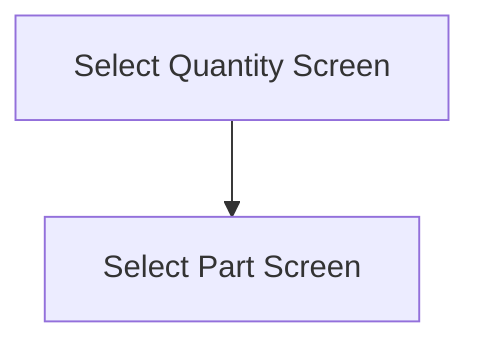

This screen allows the user to 
- Select the quantity of the Part that is non-conformant
- Select the reason as to why the Part is non-conformant 
- Create a Nonconformance entry in Epicor

If the selected Part is serial-tracked, the [Selected Quantity](#quantity) will be set the amount of serials selected on the [Select Serials Screen](./Select_Serials_Screen.md)
- The [Quantity](#quantity) control will also be disabled

# Flow

# When This Page Is Loaded
The available Nonconformance reasons are retrieved from Epicor
- This is done via a REST call to `~/Erp.BO.ReasonSvc/Reasons`
	- Where `ReasonType = 'S' and NonConfInv = true`

If no reasons are found
- An error with the message, "Could not get reasons", will be shown

The app will then set the [Selected Reason](#reason) to the first available reason

# Controls
## Reason
This control allows the user to select a reason as to why the selected Part is non-conformant

## Quantity
This control allows the user to enter a quantity of the Part that is non-conformant

This entry uses a numerical keyboard

**This entry is disable if the part is serial-tracked** 

## Create
This button is used to validate the selection and to create the Nonconformance entry within Epicor

### When This Button Is Tapped
The selection is validated

If no [Reason](#reason) has been selected
- An error with the message, "Please select a reason", is shown

Then a Nonconformance entry is created within Epicor

This is done using the following REST calls, under the `~/Erp.BO.NonConfSvc` service

**`GetNewNonConf`**
- Used to get a new Nonconformance dataset

`PartNum` is then set to the selected Part Number

**`GetPartInfo`**
- Used to get the following information about the Part
	- Revision Number
	- Default Warehouse Code
	- Default Bin Number
	- Whether it is lot-tracked
	- Whether it is dimension-tracked
	- Transaction UOM
	- Scrap UOM

The `Quantity` field is then set to
- The number of selected serials, if the selected Part is serial-tracked
- The [Selected Quantity](#quantity), if the selected Part is not serial-tracked

The `ReasonCode` field is set to the [Selected Reason](#reason)
The `EmpID` field is set to the current Employee ID
The `LotNum` field is set to the selected Lot Number (If selected)
The `ToWarehouseCode` field is set to the selected Warehouse Code
The `ToBinNum` field is set to the selected Bin Number

The `TranType` field is set to `I`

If the selected Part is serial tracked
- The `EnableSN` field is set to `true`
- Each selected serial is added to the `SelectedSerialNumbers` dataset parameter with the following fields
	- `Company` being set to the current Company
	- `SerialNumber` being set to the selected Serial Number
	- `PartNum` being set to the selected Part Number
	- `TransType` being set to `STK-INS`
	- `RowMod` being set to `A`

**`PreUpdate`**
- This is called with the updated dataset
- This will verify the dataset and updated any missing fields

**`Update`**
- This is called with the updated dataset from the previous REST call
- This will create the Nonconformance entry in Epicor

If creating the Nonconformance entry is unsuccessful
- An error with the message, returned from Epicor, is shown

If creating the Nonconformance entry is successful
- A success pop-up with the message, "NCR '{NCR Number}' created successfully", is shown
	- Where `{NCR Number}` is the number of the created Nonconformance entry

Then the following items are cleared from [Application Storage](../../../Application_Storage.md)
- `SelectedLotNumber`
- `SelectedSerials`
- `SelectedPart`
- `SelectedReason`
- `SelectedPartBin`

Then the app navigates to the [Select Part Screen](./Select_Part_Screen.md), as shown in the [Flow](#flow)
