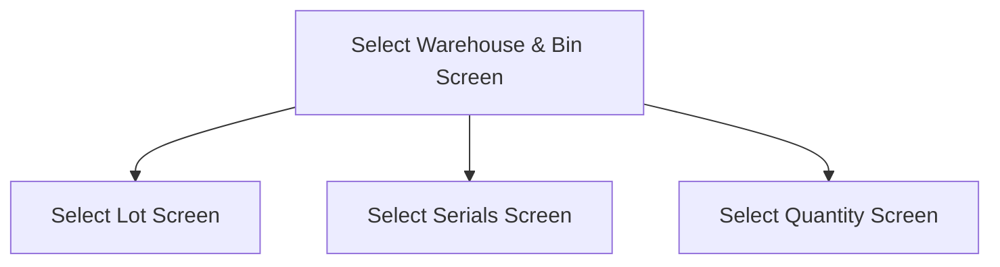

This page is used to select the Warehouse and Bin to send the nonconformant Part to

# Flow

- If the selected Part is **lot-tracked**, the app will navigate to the [Select Lot Screen](./Select_Lot_Screen.md)
- If the selected Part is **serial-tracked**, the app will navigate to the [Select Serials Screen](./Select_Serials_Screen.md)
- If the selected Part is **neither lot-tracked or serial-tracked**, the app will navigate to the [Select Quantity Screen](./Select_Quantity_Screen.md)

# When This Page Is Loaded
The warehouses are retrieved from Epicor
- This is done via a REST call to `~/Erp.BO.WarehseSearchSvc/GetList`

Then the Selected Warehouse and Selected Bin are automatically set to the first entry, respectively

# Controls
## Warehouse
This control is used to select a Warehouse

### When A Warehouse Is Selected
The Bins from that Warehouse are retrieved from Epicor
- This is done via a REST call to `~/Erp.BO.WhseBinSvc/WhseBins(Company, WarehouseCode, BinNum)`
- Ignoring Supplier Managed Bins `(BinType != "Supp")`

If no bins are found
- An error with the message, "Could not find any bins within this warehouse", will be shown

## Bin
This control is used to select a Bin from the selected Warehouse

## Scan
This control is used to scan the Warehouse and Bin using the device's camera

### When This Button Is Tapped
See [Camera Scanning](#camera-scanning)

## Select
This control is used to validate the selection and navigate to the next screen, following the logic defined under [Flow](#flow)

### When This Button Is Tapped
The app checks if a Warehouse has been selected

If no warehouse has been selected
- An error with the message, "Please select a warehouse", is shown
- Further execution halts

Then the app checks if a Bin has been selected
- An error with the message, "Please select a bin", is shown
- Further execution halts

Then the app saves the [Selected Warehouse](#warehouse) and the [Selected Bin](#bin) to the [Application Storage](../../../Application_Storage.md)

Then the app navigates to the next screen, following the logic defined under [Flow](#flow)

# Scanning
## Camera Scanning
The [Camera Scanning Process](../../../Scanning.md#camera-scanning) is triggered to allow the user to scan a barcode

Then logic defined under [How The Scanned Barcode Is Handled](#how-the-scan-result-is-handled) is followed

## Data Wedge Scanning
When a barcode is scanned by a data wedge, the logic defined under [How The Scanned Barcode Is Handled](#how-the-scan-result-is-handled) is followed

## How The Scan Result Is Handled
### If The [Warehouse Control](#warehouse) Is Focused
The app will try to find the first [Warehouse](#warehouse) where the  `WarehouseCode` is equal to the barcode

If no Warehouse is found
- An error with the message, "Could not find Warehouse '{barcode}'", is shown
	- Where `{barcode}` is the value of the scanned barcode

### If The [Bin Control](#bin) Is Focused
The app will try to find the first [Bin](#bin) where the `BinNum` is equal to the barcode

if no Bin is found
- An error with the message, "Could not find '{barcode}' in '{warehouse}'", is shown
	- Where `{barcode}` is the value of the scanned barcode
	- Where `{warehouse}` is the description of the [Selected Warehouse](#warehouse)

### If No Control Is Focused
The barcode is validated against the defined [Warehouse Bin Format](../../../Scanning.md#warehouse-bin-format)

If the barcode is invalid:
- The relevant [Barcode Validation Error](../../../Scanning.md#barcode-validation-errors) will be shown to the user

The app will try to find the first [Warehouse](#warehouse) and [Bin](#bin)

If the [Warehouse](#warehouse) could not be found
- An error with the message, "Could not find Warehouse '{warehouse}'", is shown
	- Where `{warehouse}` is the interpreted Warehouse Code from the barcode

If the [Bin](#bin) could not be found
- An error with the message, "Could not find Bin '{bin}' in '{warehouse}'", is shown
	- Where `{bin}` is the interpreted Bin Number from the barcode
	- Where `{warehouse}` is the Warehouse Code of the scanned Warehouse

If the [Warehouse](#warehouse) and [Bin](#bin) is found:
* The [Select Button Logic](#when-this-button-is-tapped-1) is followed