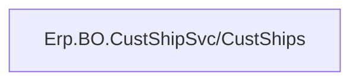
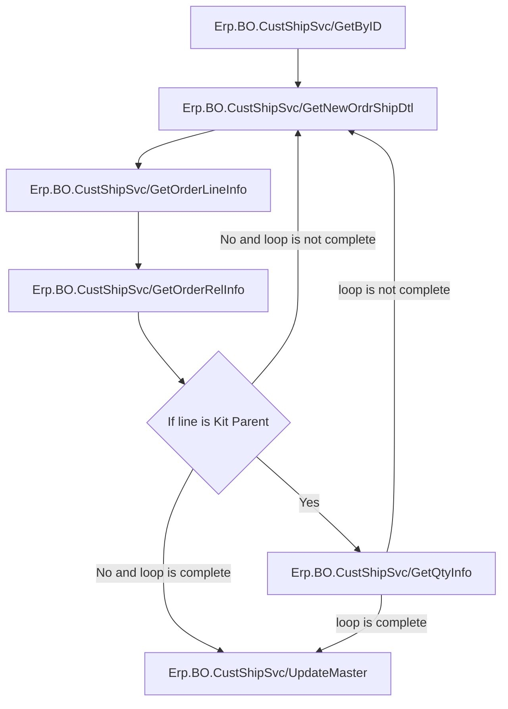

# Getting The Order Releases
The following API calls are made in the following order

See [GHA_MIMS_OrderPicking](../../Epicor/BAQs/GHA_MIMS_OrderPicking.md)

# Creating The Customer Shipment Entry
## Creating The Customer Shipment
The following API calls are made in the following order

A call is made to `~/Erp.BO.CustShipSvc/CustShips` to create a new Customer Shipment entry

## Adding The Lines To The Customer Shipment
The following API calls are made

An initial call to `~/Erp.BO.CustShipSvc/GetByID` is made to get the Customer Shipment
- If no Customer Shipment exists, a Customer Shipment will be created
	- See [Creating The Customer Shipment](#creating-the-customer-shipment)

Then each line will make the following API calls
- A call to `~/Erp.BO.CustShipSvc/GetNewOrdrShipDtl` is made to get a new line dataset
- A call to `~/Erp.BO.CustShipSvc/GetOrderInfo` is made to bring information over from the selected Order
- A call to `~/Erp.BO.CustShipSvc/GetOrderLineInfo` is made to bring information over from the selected Order Release's line
- A call to `~/Erp.BO.CustShipSvc/GetOrderRelInfo` is made to bring information over from the selected Order Release
- If the current Part is a Sales Kit Parent
	- A call to `Erp.BO.CustShipSvc/GetQtyInfo` is made to get the quantity for the Part

Finally, a call to `~/Erp.BO.CustShipSvc/UpdateMaster` is made to save the lines in Epicor

## Creating The Package
The following API calls are made in the following order

A call to `~/Erp.BO.CustShipSvc/CustShips` is made to update the package information with the selected package
# Completing The Customer Shipment
The following API calls are made in the following order

A call is made to `~/Erp.BO.CustShipSvc/CustShips` to set `ReadyToInvoice` to `true`

# Printing
## Packing Slips
A REST call is made to `~/Erp.Rpt.PackingSlipPrintSvc/SubmitToAgent`
- Where `PrintingOptions = 'S'`
- Refer to [How MIMS Creates Reports In Epicor](../../Printing.md#how-mims-creates-reports-in-epicor) for additional information about this REST call

## Shipping Labels
A REST call is made to `~/Erp.Rpt.PackingSlipPrintSvc/SubmitToAgent`
- Where `PrintingOptions = 'L'`
- Refer to [How MIMS Creates Reports In Epicor](../../Printing.md#how-mims-creates-reports-in-epicor) for additional information about this REST call

## Both
A REST call is made to `~/Erp.Rpt.PackingSlipPrintSvc/SubmitToAgent`
- Where `PrintingOptions = 'B'`
- Refer to [How MIMS Creates Reports In Epicor](../../Printing.md#how-mims-creates-reports-in-epicor) for additional information about this REST call