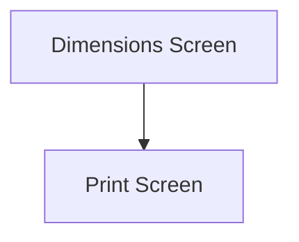

This screen is used to add the package information to the current Shipment

# Flow

# When This Page Is Loaded
The app will retrieve the available packages from Epicor
- This is done via a REST call to `~/Erp.Bo.PackingSvc/Packings`

The app will retrieve the available weight UOMs from Epicor
- This is done via a REST call to `~/Erp.Bo.UOMClassSvc/UOMClasses(Company, UOMClass)/UOMConvs`
	- Where `Company` is the current company
	- Where `UOMClass` is `Weight`

The app will retrieve the available size UOMs from Epicor
- This is done via a REST call to `~/Erp.BO.UOMClassSvc/UOMClasses(Company, UOMClass)/UOMConvs`
	- Where `Company` is the current company
	- Where `UOMClass` is `Length`

# Controls
## Package Type
This control is used to select the type of Package

### When A Package Is Selected
- The [Selected Length](#length) is set to the package's default Length
- The [Selected Width](#width) is set to the package's default Width
- The [Selected Height](#height) is set to the package's default Height
- The [Selected Size UOM](#size-uom) is set to the package's default Size UOM
- The [Selected Weight](#weight) is set to the package's default Weight
- The [Selected Weight UOM](#weight-uom) is set to the package's default Weight UOM

The above controls are then enabled

## Length
This control is used to enter the length of the package

## Width
This control is used to enter the width of the package

## Height
This control is used to enter the height of the package

## Size UOM
This control is used to select the UOM of the package's length, width and height

## Weight
This control is used to enter the weight of the package

## Weight UOM
This control is used to enter the UOM of the package's weight

## Scan
This control is used to scan the Package Type using the device's camera

### When This Button Is Tapped
See [Camera Scanning](#camera-scanning)

## Confirm
This control is used to confirm the selection and create the Customer Shipment in Epicor

### When This Button Is Tapped
The Customer Shipment is created in Epicor and the Package is added
- Please refer to all sections of the [Creating The Customer Shipment Entry](../Epicor_Processes.md#creating-the-customer-shipment-entry) for further information

# Scanning
## Camera Scanning
The [Camera Scanning Process](#camera-scanning) is triggered to allow the user to scan a barcode

Then logic defined under [How The Scanned Barcode Is Handled](#how-the-scanned-barcode-is-handled) is followed

## Data Wedge Scanning
When a barcode is scanned by a data wedge, the logic defined under [How The Scanned Barcode Is Handled](#how-the-scanned-barcode-is-handled) is followed

## How The Scanned Barcode Is Handled
The barcode is validated against the defined [Package Format](../../../Scanning.md#warehouse-bin-format) 

If the barcode is invalid:
- The relevant [Barcode Validation Error](../../../Scanning.md#barcode-validation-errors) will be shown to the user

Then the app will attempt to find the scanned Package from the [List Of Packages](#package-type)

If no package is found
- An error the message, "Package {Package Type} not found", is shown
	- Where `{Package Type}` is the Package Type interpreted from the barcode

Then the [Package Type Selection Logic](#when-a-package-is-selected) is followed