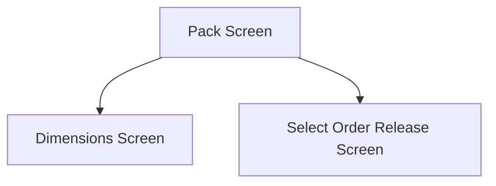

This screen is used to enter the quantity of the selected Order Release's Part to pack

This screen will display the following information about the selected Pack
- The Part Number
- The Required Quantity

If a Warehouse & Bin has been selected, the following information will also be shown
- The Quantity On Hand
- The Selected Warehouse
- The Selected Bin

If a Lot Number has been selected, the following information will also be shown
- The Selected Lot Number

If Serial Numbers have been selected, the following information will also be shown
- The number of Selected Serial Numbers

# Flow

If there a zero remaining Order Releases
- A prompt with the message, "There are no more order releases that can be added to this pack", is shown
- The app will navigate to the [Dimensions Screen](./Dimensions_Screen.md)

If there are zero remaining Order Releases, for the current Customer
- A prompt with the message, "All lines for this customer have been picked", is shown
- The app will navigate to the [Dimensions Screen](./Dimensions_Screen.md)

If there are zero remaining Order Releases, for the given [Picking Type](../../../MIMS_Parameters.md#picking-type)
- The app will navigate to the [Select Order Type Screen](./Select_Order_Type_Screen.md)

Otherwise
- The app will navigate to the [Select Order Release Screen](./Select_Order_Release_Screen.md)

# When This Page Is Loaded
The [Selected Quantity](#quantity) will be determined

If the part is serial-tracked
- The number of selected Serial Numbers will be chosen
- The [Quantity Control](#quantity) will be disabled

If the part is not serial-tracked
- Either the Required Quantity or available Quantity On Hand will be chosen
	- Depending on the smallest of the two

# Controls
## Quantity
This control is used to enter the quantity of the part to pack

If the part is serial-tracked
- This control is disabled
- This control will display the number of selected serial numbers from the previous screen

## Pack
This control is used to add the line to the Pack and continue the packing process

### When This Button Is Tapped
The app will validate the selection

If the chosen quantity is greater than the required quantity
- An error with the message, "The quantity entered is greater than the required quantity", is shown

The item is then added to the Pack
- This is not done in Epicor, but instead it is saved in the [Application Storage](../../../Application_Storage.md) to be packed on the [Dimensions Screen](./Dimensions_Screen.md) later
	- This is done so that the selection for a Sales Kit can be completed before adding the pack to Epicor

The number of remaining Order Releases will be calculated based on the [Picking Type](../../../MIMS_Parameters.md#picking-type)

The app will also calculate the number of remaining Order Releases based on the current Customer
- The current customer being the customer against the chosen Order Release

Based on this number, the app will navigate to the next page as defined under [Flow](#flow)

