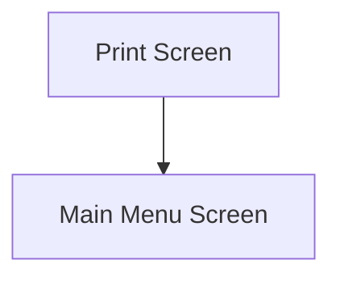

This screen is used to print the Customer Shipment

# Flow

# When This Page Is Loaded
The printers are retrieved from Epicor
- See [How MIMS Retrieves The Available Printers](../../../Printing.md#how-mims-retrieves-the-available-printers)

The [Selected Printer](#printers) is set to the first default Printer

The [Selected Printing Option](#printing-options) is set the first Printing Option

# Controls
## Printing Options
This control is used to select the Printing Option

The following printing options are available
- `Packing Slip
- `Shipping Labels`
- `Both`
- `None`

## Printers
This control is used to select a Printer from the list of available Printers

## Complete
This control is used to execute the selected Printing Option and complete the Customer Shipment

### When This Button Is Tapped
The app will complete the Customer Shipment
- See [Completing The Customer Shipment](../Epicor_Processes.md#completing-the-customer-shipment)

If the [Selected Printing Option](#printing-options) is `None`
- The app will clear the following properties from the [Application Storage](../../../Application_Storage.md)
	- `CurrentShipment`
	- `CurrentShipmentList`
- The app will navigate to the [Home Page](../../Home_Page.md)

The app will then validate the selection

Otherwise, the app will create the Report, to be printed, in Epicor
- See [Printing](../Epicor_Processes.md#printing)

The app will clear the following properties from the [Application Storage](../../../Application_Storage.md)
- `CurrentShipment`
- `CurrentShipmentList`

The app will navigate to the [Home Page](../../Home_Page.md)