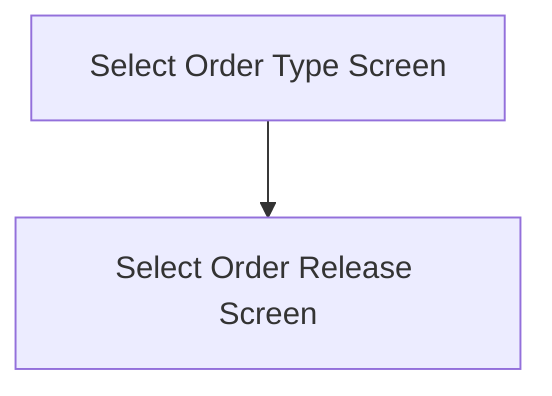

This screen is used to select the a collection of Order Releases grouped into the following criteria
- Push
- Ship To
- Order
- Ship Via

*NOTE: Please note that the "Ship Via" order type is not currently implemented*

The page will display one of the following based on the [Picking Type](../../../MIMS_Parameters.md#picking-type)
- "Select Ship To"
- "Select Order Number"
- "Select Courier"

# Flow

# When This Page Is Loaded
This app will clear the following properties from [Application Storage](../../../Application_Storage.md)
- `SelectedLotNumber`
- `SelectedPartSerials`
- `SelectedWarehouseBin`
- `SelectedQuantity`

Then the app will retrieve the Order Releases from Epicor
- See [Getting The Order Releases](../Epicor_Processes.md#getting-the-order-releases)

If no orders are returned
- An error with the message, "No orders were found", is shown

If the [MIMS Push](../../../MIMS_Parameters.md#display-next-pick-only) parameter is set to `true`
- The app will navigate to the [Select Order Release Screen](./Select_Order_Release_Screen.md)

If the [Picking Type Parameter](../../../MIMS_Parameters.md#picking-type) is set to `SHIPTO`
- The retrieved orders will be grouped by
	- `ShipToName`
	- `CustomerName`
	- `CustNum`
	- `ShipToNum`

If the [Picking Type](../../../MIMS_Parameters.md#picking-type) is set to `ORDER`
- The retrieved orders will be grouped by
	- `OrderNum`

If the [Picking Type](../../../MIMS_Parameters.md#picking-type) is set to `SHIPVIA`
- Nothing will happen as grouping by Ship Via has not been implemented

# Controls
## Order Type List
This control is used to select a collection of Order Releases based on the current grouping type

### When An Order Type Group Is Tapped
The app will save the selected Order Release Tap to the [Application Storage](../../../Application_Storage.md)

The app will then navigate to the [Select Order Release Screen](./Select_Order_Release_Screen.md)

