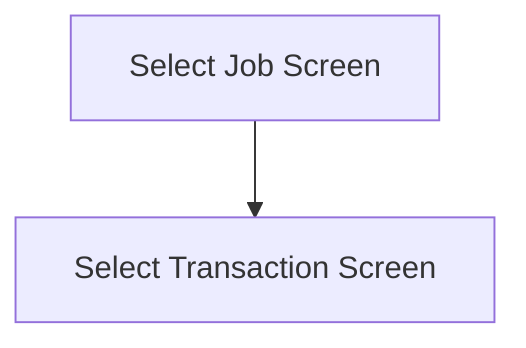

This screen is used to select a Job Number and a Transaction Type to filter the transactions to reprint

# Flow

# Controls
## Job Number
This control is used to enter the Job Number

## Transaction Type
This control is used to select one of the following Transaction Types
- `Job To Inventory`
- `Job To Job`

## Scan Job
This control is used to scan the [Job Number](#job-number) using the device's camera

### When This Button Is Tapped
See [Camera Scanning](#camera-scanning)

## Select
This control is used to validate the selection and navigate to the next screen

### When This Button Is Tapped
The app will validate the selection

If no [Job Number](#job-number) has been entered
- An error with the message, "Please enter a Job Number" is shown

If no [Transaction Type](#transaction-type) has been chosen
- An error with the message, "Please pick a Transaction Type", is shown

The app will then navigate to the next screen as defined under [Flow](#flow)

# Scanning
## Camera Scanning
The [Camera Scanning Process](../../../../Scanning.md#camera-scanning) is triggered to allow the user to scan a barcode

Then logic defined under [How The Scanned Barcode Is Handled](#how-the-scanned-barcode-is-handled) is followed

## Data Wedge Scanning
When a barcode is scanned by a data wedge, the logic defined under [How The Scanned Barcode Is Handled](#how-the-scanned-barcode-is-handled) is followed

## How The Scanned Barcode Is Handled
The barcode is validated against the defined [Job Format](../../../../Scanning.md#job-number) 

If the barcode is invalid:
- The relevant [Barcode Validation Error](../../../../Scanning.md#barcode-validation-errors) will be shown to the user

Then the app will set the [Selected Job Number](#job-number) to the value of the barcode

Then the [Select Button Logic](#when-this-button-is-tapped-1) is followed