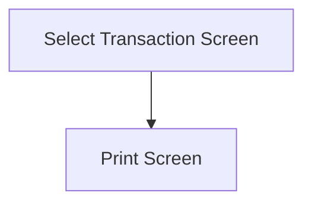

This screen is used to select a Transaction found from the select Job Number and Transaction Type

# Flow

# When This Page Is Loaded
The Transactions are retrieved from Epicor
- This is done via a REST call to `~/Erp.BO.PartTranSvc/PartTrans`

The transactions are then filtered by the selected Transaction Type
- If the selected Transaction Type is `Job to Inventory`
	- The transactions are filtered by `TranType = MFG-STK`
- If the selected Transaction Type is `Job to Job`
	- The transactions are filtered by `TranType = MFG-WIP`

# Controls
## Transactions
This control is used to select the Transaction to reprint

### When A Transaction Is Tapped
The selected Transaction is saved to the [Application Storage](../../../../Application_Storage.md)

The app navigates to the [Print Screen](./Print_Screen.md)